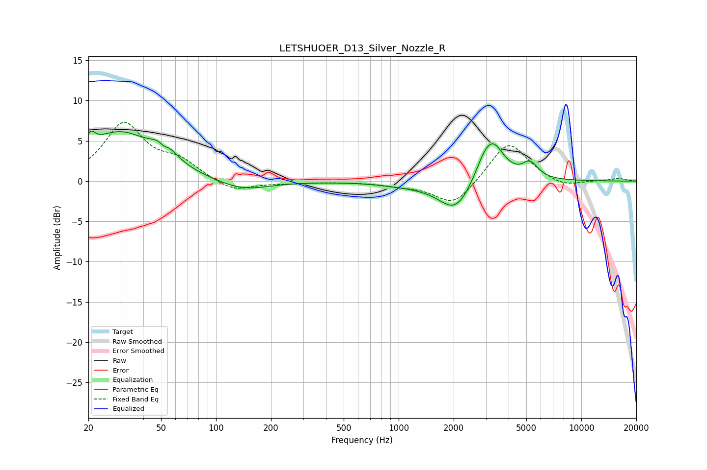

# LETSHUOER_D13_Silver_Nozzle_R
See [usage instructions](https://github.com/jaakkopasanen/AutoEq#usage) for more options and info.

### Parametric EQs
Apply preamp of -6.3 dB when using parametric equalizer.

|   # | Type    |   Fc (Hz) |    Q |   Gain (dB) |
|-----|---------|-----------|------|-------------|
|   1 | Peaking |        21 | 5.77 |         1.6 |
|   2 | Peaking |        29 | 0.75 |         5.9 |
|   3 | Peaking |        52 | 2.53 |         2.2 |
|   4 | Peaking |        52 | 5.83 |        -0.9 |
|   5 | Peaking |       139 | 0.99 |        -1.3 |
|   6 | Peaking |      1164 | 0.86 |        -0.4 |
|   7 | Peaking |      2049 | 1.58 |        -3.8 |
|   8 | Peaking |      2894 | 2.87 |         1.2 |
|   9 | Peaking |      3266 | 2.16 |         4.9 |
|  10 | Peaking |      5248 | 3.24 |         1.9 |

### Fixed Band EQs
When using fixed band (also called graphic) equalizer, apply preamp of **-7.4 dB** (if available) and set gains manually with these parameters.

|   # | Type    |   Fc (Hz) |    Q |   Gain (dB) |
|-----|---------|-----------|------|-------------|
|   1 | Peaking |        31 | 1.41 |         7   |
|   2 | Peaking |        62 | 1.41 |         2.1 |
|   3 | Peaking |       125 | 1.41 |        -1.4 |
|   4 | Peaking |       250 | 1.41 |        -0.2 |
|   5 | Peaking |       500 | 1.41 |        -0   |
|   6 | Peaking |      1000 | 1.41 |        -0.4 |
|   7 | Peaking |      2000 | 1.41 |        -3.1 |
|   8 | Peaking |      4000 | 1.41 |         5.1 |
|   9 | Peaking |      8000 | 1.41 |        -0.8 |
|  10 | Peaking |     16000 | 1.41 |         0.3 |

### Graphs

