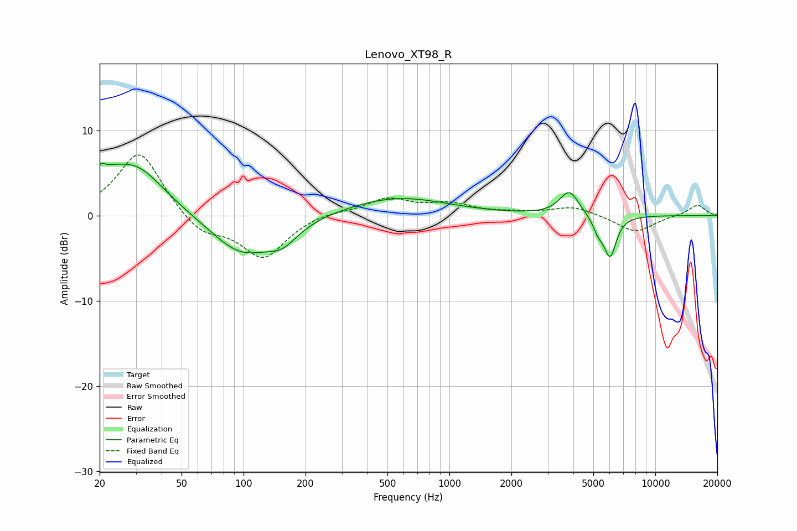

# Lenovo_XT98_R
See [usage instructions](https://github.com/jaakkopasanen/AutoEq#usage) for more options and info.

### Parametric EQs
Apply preamp of -6.2 dB when using parametric equalizer.

|   # | Type    |   Fc (Hz) |    Q |   Gain (dB) |
|-----|---------|-----------|------|-------------|
|   1 | Peaking |        21 | 5.2  |         3.7 |
|   2 | Peaking |        21 | 5.98 |        -2.2 |
|   3 | Peaking |        22 | 1.56 |         1.6 |
|   4 | Peaking |        30 | 1    |         5.3 |
|   5 | Peaking |        98 | 0.95 |        -4.6 |
|   6 | Peaking |       154 | 1.84 |        -2.1 |
|   7 | Peaking |       557 | 0.58 |         2.2 |
|   8 | Peaking |      3821 | 3    |         2.9 |
|   9 | Peaking |      5275 | 5.27 |        -1.5 |
|  10 | Peaking |      6032 | 4.53 |        -4.7 |

### Fixed Band EQs
When using fixed band (also called graphic) equalizer, apply preamp of **-7.2 dB** (if available) and set gains manually with these parameters.

|   # | Type    |   Fc (Hz) |    Q |   Gain (dB) |
|-----|---------|-----------|------|-------------|
|   1 | Peaking |        31 | 1.41 |         7.7 |
|   2 | Peaking |        62 | 1.41 |        -2.3 |
|   3 | Peaking |       125 | 1.41 |        -4.9 |
|   4 | Peaking |       250 | 1.41 |         0.5 |
|   5 | Peaking |       500 | 1.41 |         1.9 |
|   6 | Peaking |      1000 | 1.41 |         1.2 |
|   7 | Peaking |      2000 | 1.41 |         0.2 |
|   8 | Peaking |      4000 | 1.41 |         1.1 |
|   9 | Peaking |      8000 | 1.41 |        -2   |
|  10 | Peaking |     16000 | 1.41 |         1.3 |

### Graphs

