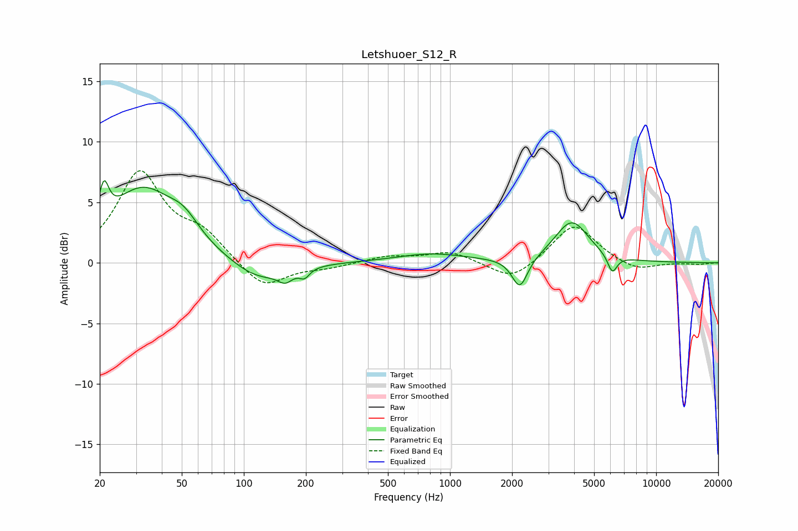

# Letshuoer_S12_R
See [usage instructions](https://github.com/jaakkopasanen/AutoEq#usage) for more options and info.

### Parametric EQs
Apply preamp of -6.9 dB when using parametric equalizer.

|   # | Type    |   Fc (Hz) |    Q |   Gain (dB) |
|-----|---------|-----------|------|-------------|
|   1 | Peaking |        21 | 6    |         3   |
|   2 | Peaking |        32 | 0.86 |         5.9 |
|   3 | Peaking |        51 | 1.93 |         1.5 |
|   4 | Peaking |       116 | 1.08 |        -1.7 |
|   5 | Peaking |       159 | 3.92 |        -0.9 |
|   6 | Peaking |       197 | 5.9  |        -0.7 |
|   7 | Peaking |       812 | 0.84 |         0.7 |
|   8 | Peaking |      2181 | 3.74 |        -2.6 |
|   9 | Peaking |      3897 | 1.72 |         3.4 |
|  10 | Peaking |      6129 | 5.89 |        -1.5 |

### Fixed Band EQs
When using fixed band (also called graphic) equalizer, apply preamp of **-7.7 dB** (if available) and set gains manually with these parameters.

|   # | Type    |   Fc (Hz) |    Q |   Gain (dB) |
|-----|---------|-----------|------|-------------|
|   1 | Peaking |        31 | 1.41 |         7.3 |
|   2 | Peaking |        62 | 1.41 |         2.1 |
|   3 | Peaking |       125 | 1.41 |        -2.2 |
|   4 | Peaking |       250 | 1.41 |        -0.4 |
|   5 | Peaking |       500 | 1.41 |         0.5 |
|   6 | Peaking |      1000 | 1.41 |         0.9 |
|   7 | Peaking |      2000 | 1.41 |        -1.6 |
|   8 | Peaking |      4000 | 1.41 |         3.3 |
|   9 | Peaking |      8000 | 1.41 |        -0.7 |
|  10 | Peaking |     16000 | 1.41 |        -0.1 |

### Graphs

