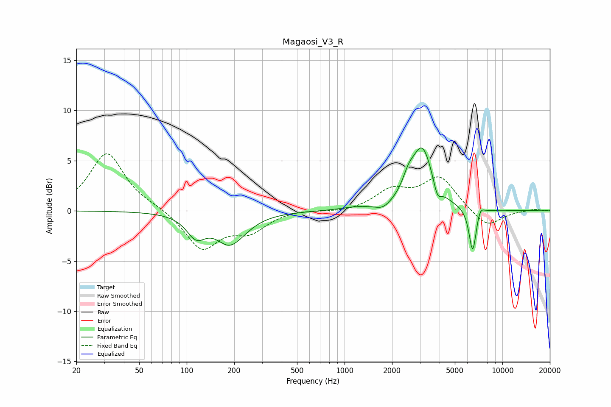

# Magaosi_V3_R
See [usage instructions](https://github.com/jaakkopasanen/AutoEq#usage) for more options and info.

### Parametric EQs
Apply preamp of -6.4 dB when using parametric equalizer.

|   # | Type    |   Fc (Hz) |    Q |   Gain (dB) |
|-----|---------|-----------|------|-------------|
|   1 | Peaking |       115 | 2.37 |        -2.1 |
|   2 | Peaking |       193 | 1.57 |        -3.7 |
|   3 | Peaking |       204 | 2.43 |         0.6 |
|   4 | Peaking |      1176 | 1.56 |         0.2 |
|   5 | Peaking |      1756 | 2.98 |        -0.6 |
|   6 | Peaking |      2540 | 3.85 |         1.4 |
|   7 | Peaking |      3109 | 2.1  |         6.1 |
|   8 | Peaking |      3872 | 5.86 |        -1.5 |
|   9 | Peaking |      6485 | 5.98 |        -4.5 |
|  10 | Peaking |      7232 | 6    |         0.9 |

### Fixed Band EQs
When using fixed band (also called graphic) equalizer, apply preamp of **-5.8 dB** (if available) and set gains manually with these parameters.

|   # | Type    |   Fc (Hz) |    Q |   Gain (dB) |
|-----|---------|-----------|------|-------------|
|   1 | Peaking |        31 | 1.41 |         5.8 |
|   2 | Peaking |        62 | 1.41 |         0.3 |
|   3 | Peaking |       125 | 1.41 |        -3.8 |
|   4 | Peaking |       250 | 1.41 |        -1.8 |
|   5 | Peaking |       500 | 1.41 |         0.2 |
|   6 | Peaking |      1000 | 1.41 |        -0.2 |
|   7 | Peaking |      2000 | 1.41 |         1.9 |
|   8 | Peaking |      4000 | 1.41 |         3.3 |
|   9 | Peaking |      8000 | 1.41 |        -1.7 |
|  10 | Peaking |     16000 | 1.41 |         0.2 |

### Graphs

