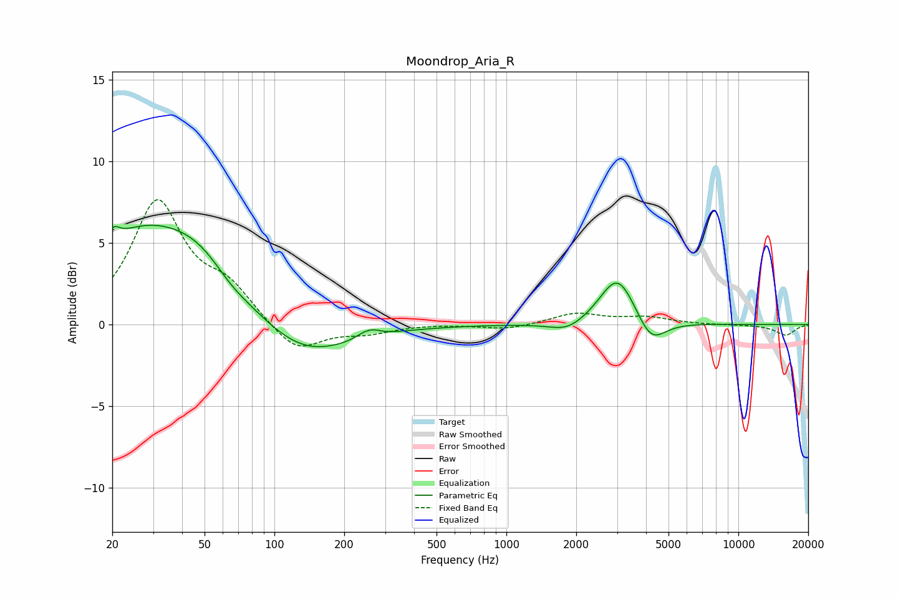

# Moondrop_Aria_R
See [usage instructions](https://github.com/jaakkopasanen/AutoEq#usage) for more options and info.

### Parametric EQs
Apply preamp of -6.2 dB when using parametric equalizer.

|   # | Type    |   Fc (Hz) |    Q |   Gain (dB) |
|-----|---------|-----------|------|-------------|
|   1 | Peaking |        20 | 5.8  |         0.8 |
|   2 | Peaking |        26 | 0.55 |         5.2 |
|   3 | Peaking |        51 | 0.84 |         2.5 |
|   4 | Peaking |        64 | 1.55 |        -0.9 |
|   5 | Peaking |       132 | 0.69 |        -2.3 |
|   6 | Peaking |       255 | 5.68 |        -0.2 |
|   7 | Peaking |       255 | 3.75 |         0.7 |
|   8 | Peaking |      1835 | 1.85 |        -0.6 |
|   9 | Peaking |      3020 | 1.85 |         3.1 |
|  10 | Peaking |      4195 | 2.28 |        -1.7 |

### Fixed Band EQs
When using fixed band (also called graphic) equalizer, apply preamp of **-7.8 dB** (if available) and set gains manually with these parameters.

|   # | Type    |   Fc (Hz) |    Q |   Gain (dB) |
|-----|---------|-----------|------|-------------|
|   1 | Peaking |        31 | 1.41 |         7.4 |
|   2 | Peaking |        62 | 1.41 |         1.9 |
|   3 | Peaking |       125 | 1.41 |        -1.8 |
|   4 | Peaking |       250 | 1.41 |        -0.5 |
|   5 | Peaking |       500 | 1.41 |         0   |
|   6 | Peaking |      1000 | 1.41 |        -0.3 |
|   7 | Peaking |      2000 | 1.41 |         0.7 |
|   8 | Peaking |      4000 | 1.41 |         0.4 |
|   9 | Peaking |      8000 | 1.41 |        -0   |
|  10 | Peaking |     16000 | 1.41 |        -0.7 |

### Graphs

