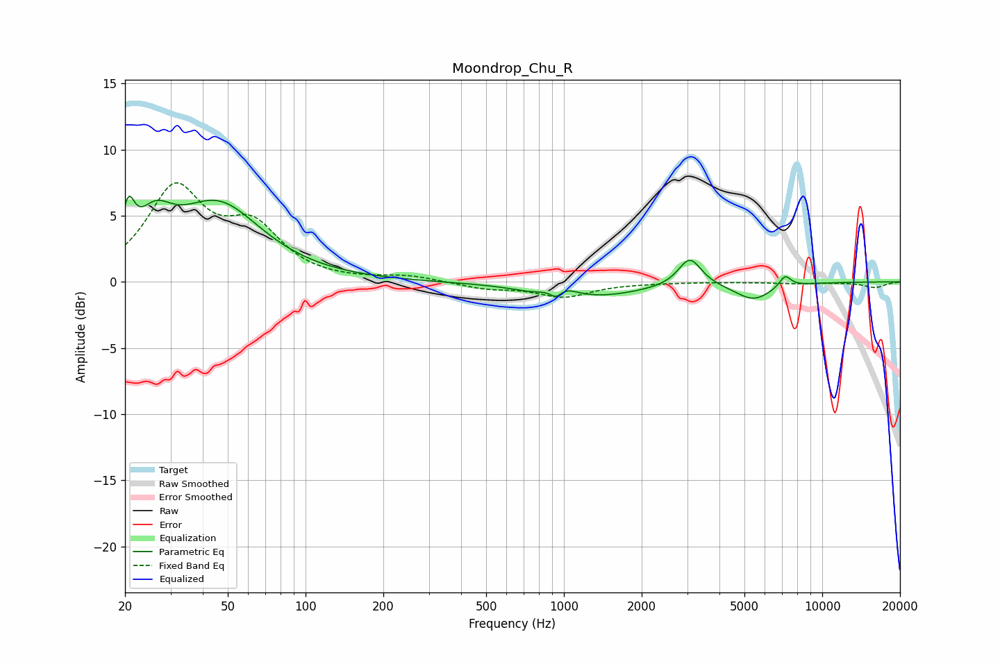

# Moondrop_Chu_R
See [usage instructions](https://github.com/jaakkopasanen/AutoEq#usage) for more options and info.

### Parametric EQs
Apply preamp of -6.6 dB when using parametric equalizer.

|   # | Type    |   Fc (Hz) |    Q |   Gain (dB) |
|-----|---------|-----------|------|-------------|
|   1 | Peaking |        21 | 5.92 |         3.2 |
|   2 | Peaking |        26 | 2.12 |         2.9 |
|   3 | Peaking |        46 | 0.84 |         5.7 |
|   4 | Peaking |       753 | 2.2  |        -0.2 |
|   5 | Peaking |       933 | 5.83 |        -0.8 |
|   6 | Peaking |       972 | 2.75 |         0.9 |
|   7 | Peaking |      1256 | 0.72 |        -1.2 |
|   8 | Peaking |      3071 | 3.2  |         2.2 |
|   9 | Peaking |      5413 | 1.9  |        -1.3 |
|  10 | Peaking |      7178 | 5.87 |         0.9 |

### Fixed Band EQs
When using fixed band (also called graphic) equalizer, apply preamp of **-7.6 dB** (if available) and set gains manually with these parameters.

|   # | Type    |   Fc (Hz) |    Q |   Gain (dB) |
|-----|---------|-----------|------|-------------|
|   1 | Peaking |        31 | 1.41 |         6.8 |
|   2 | Peaking |        62 | 1.41 |         3.7 |
|   3 | Peaking |       125 | 1.41 |        -0   |
|   4 | Peaking |       250 | 1.41 |         0.4 |
|   5 | Peaking |       500 | 1.41 |        -0.5 |
|   6 | Peaking |      1000 | 1.41 |        -1.1 |
|   7 | Peaking |      2000 | 1.41 |        -0   |
|   8 | Peaking |      4000 | 1.41 |        -0   |
|   9 | Peaking |      8000 | 1.41 |        -0.1 |
|  10 | Peaking |     16000 | 1.41 |        -0.4 |

### Graphs

