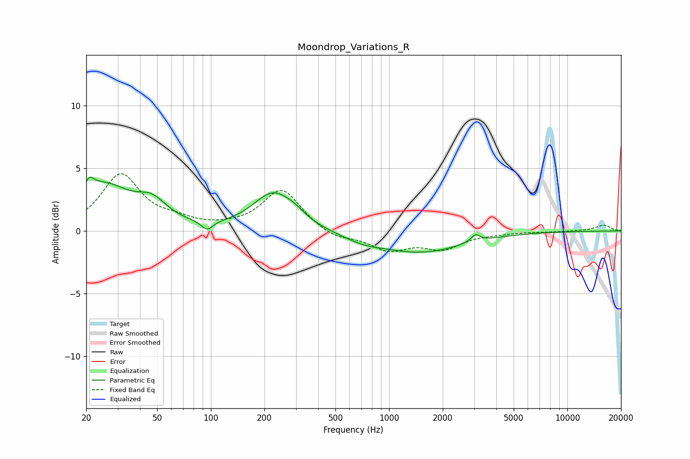

# Moondrop_Variations_R
See [usage instructions](https://github.com/jaakkopasanen/AutoEq#usage) for more options and info.

### Parametric EQs
Apply preamp of -4.4 dB when using parametric equalizer.

|   # | Type    |   Fc (Hz) |    Q |   Gain (dB) |
|-----|---------|-----------|------|-------------|
|   1 | Peaking |        21 | 5.95 |         3.2 |
|   2 | Peaking |        21 | 5.81 |        -2.5 |
|   3 | Peaking |        24 | 0.85 |         3.6 |
|   4 | Peaking |        47 | 1.79 |         1.4 |
|   5 | Peaking |        95 | 4.4  |        -0.8 |
|   6 | Peaking |       224 | 1.26 |         2.9 |
|   7 | Peaking |       297 | 2.25 |         0.4 |
|   8 | Peaking |       714 | 1.3  |        -0.5 |
|   9 | Peaking |      1501 | 0.59 |        -1.7 |
|  10 | Peaking |      3049 | 5.71 |         0.6 |

### Fixed Band EQs
When using fixed band (also called graphic) equalizer, apply preamp of **-4.7 dB** (if available) and set gains manually with these parameters.

|   # | Type    |   Fc (Hz) |    Q |   Gain (dB) |
|-----|---------|-----------|------|-------------|
|   1 | Peaking |        31 | 1.41 |         4.4 |
|   2 | Peaking |        62 | 1.41 |         0.6 |
|   3 | Peaking |       125 | 1.41 |         0.1 |
|   4 | Peaking |       250 | 1.41 |         3.3 |
|   5 | Peaking |       500 | 1.41 |        -0.6 |
|   6 | Peaking |      1000 | 1.41 |        -1.4 |
|   7 | Peaking |      2000 | 1.41 |        -1.3 |
|   8 | Peaking |      4000 | 1.41 |        -0.1 |
|   9 | Peaking |      8000 | 1.41 |        -0.1 |
|  10 | Peaking |     16000 | 1.41 |         0.5 |

### Graphs

