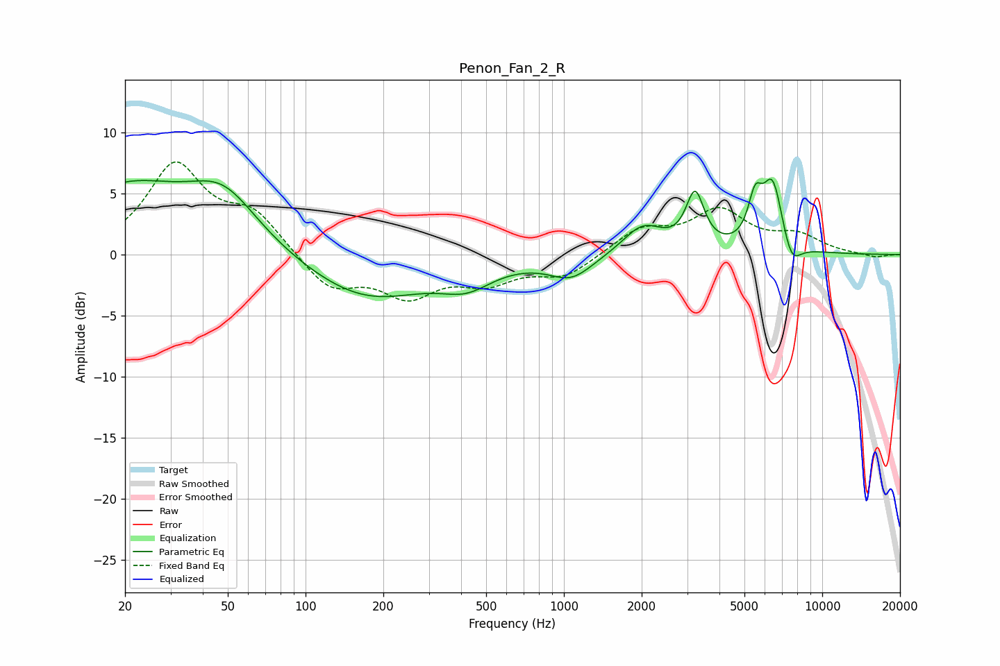

# Penon_Fan_2_R
See [usage instructions](https://github.com/jaakkopasanen/AutoEq#usage) for more options and info.

### Parametric EQs
Apply preamp of -6.3 dB when using parametric equalizer.

|   # | Type    |   Fc (Hz) |    Q |   Gain (dB) |
|-----|---------|-----------|------|-------------|
|   1 | Peaking |        20 | 0.59 |         5.3 |
|   2 | Peaking |        48 | 1.05 |         4.1 |
|   3 | Peaking |       173 | 0.6  |        -3.7 |
|   4 | Peaking |       420 | 1.41 |        -1.7 |
|   5 | Peaking |      1067 | 1.65 |        -1.8 |
|   6 | Peaking |      2025 | 1.78 |         2.4 |
|   7 | Peaking |      3219 | 4.04 |         4.5 |
|   8 | Peaking |      5495 | 5.24 |         3.2 |
|   9 | Peaking |      6429 | 3.29 |         5.9 |
|  10 | Peaking |      7582 | 3.68 |        -2.2 |

### Fixed Band EQs
When using fixed band (also called graphic) equalizer, apply preamp of **-7.7 dB** (if available) and set gains manually with these parameters.

|   # | Type    |   Fc (Hz) |    Q |   Gain (dB) |
|-----|---------|-----------|------|-------------|
|   1 | Peaking |        31 | 1.41 |         7.1 |
|   2 | Peaking |        62 | 1.41 |         3.1 |
|   3 | Peaking |       125 | 1.41 |        -2.8 |
|   4 | Peaking |       250 | 1.41 |        -3.1 |
|   5 | Peaking |       500 | 1.41 |        -1.9 |
|   6 | Peaking |      1000 | 1.41 |        -1.7 |
|   7 | Peaking |      2000 | 1.41 |         2   |
|   8 | Peaking |      4000 | 1.41 |         3.4 |
|   9 | Peaking |      8000 | 1.41 |         1.4 |
|  10 | Peaking |     16000 | 1.41 |        -0.3 |

### Graphs

