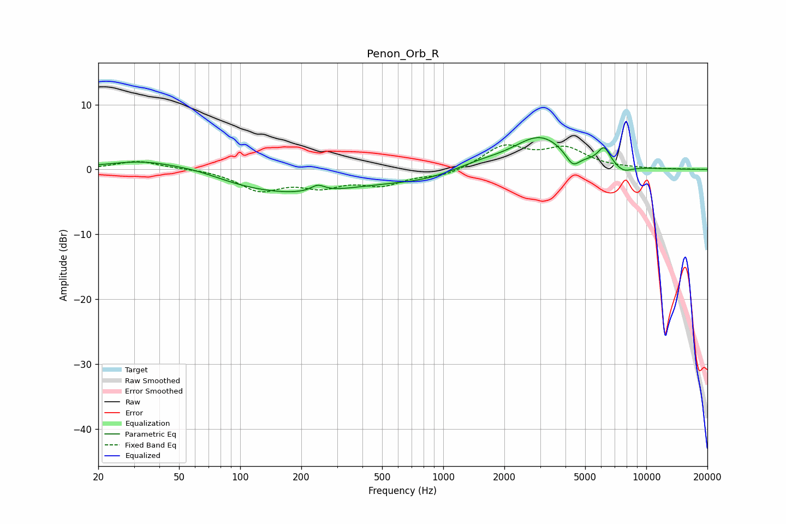

# Penon_Orb_R
See [usage instructions](https://github.com/jaakkopasanen/AutoEq#usage) for more options and info.

### Parametric EQs
Apply preamp of -5.0 dB when using parametric equalizer.

|   # | Type    |   Fc (Hz) |    Q |   Gain (dB) |
|-----|---------|-----------|------|-------------|
|   1 | Peaking |        34 | 0.75 |         1.7 |
|   2 | Peaking |        63 | 1.14 |         0.6 |
|   3 | Peaking |       175 | 0.4  |        -3.7 |
|   4 | Peaking |       241 | 4.25 |         1   |
|   5 | Peaking |       807 | 0.77 |        -1.2 |
|   6 | Peaking |      1494 | 1.09 |         0.9 |
|   7 | Peaking |      3006 | 1.06 |         5   |
|   8 | Peaking |      4342 | 3.98 |        -2.2 |
|   9 | Peaking |      6199 | 4.53 |         2.6 |
|  10 | Peaking |      7711 | 3.06 |        -1   |

### Fixed Band EQs
When using fixed band (also called graphic) equalizer, apply preamp of **-3.9 dB** (if available) and set gains manually with these parameters.

|   # | Type    |   Fc (Hz) |    Q |   Gain (dB) |
|-----|---------|-----------|------|-------------|
|   1 | Peaking |        31 | 1.41 |         1.3 |
|   2 | Peaking |        62 | 1.41 |         0.1 |
|   3 | Peaking |       125 | 1.41 |        -3   |
|   4 | Peaking |       250 | 1.41 |        -2.2 |
|   5 | Peaking |       500 | 1.41 |        -2.1 |
|   6 | Peaking |      1000 | 1.41 |        -1   |
|   7 | Peaking |      2000 | 1.41 |         3.5 |
|   8 | Peaking |      4000 | 1.41 |         3   |
|   9 | Peaking |      8000 | 1.41 |         0.1 |
|  10 | Peaking |     16000 | 1.41 |         0.1 |

### Graphs

