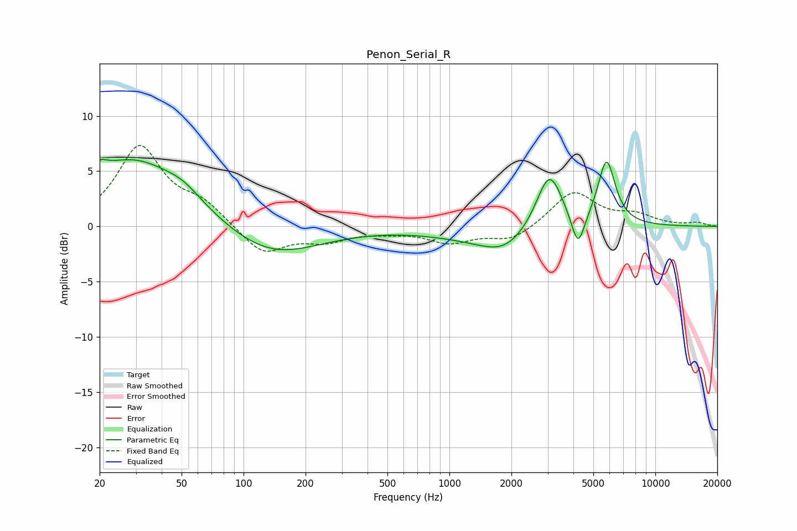

# Penon_Serial_R
See [usage instructions](https://github.com/jaakkopasanen/AutoEq#usage) for more options and info.

### Parametric EQs
Apply preamp of -6.2 dB when using parametric equalizer.

|   # | Type    |   Fc (Hz) |    Q |   Gain (dB) |
|-----|---------|-----------|------|-------------|
|   1 | Peaking |        21 | 5.45 |         3.5 |
|   2 | Peaking |        21 | 5.92 |        -2.6 |
|   3 | Peaking |        29 | 0.56 |         6.1 |
|   4 | Peaking |        51 | 1.63 |         0.9 |
|   5 | Peaking |       135 | 0.62 |        -2.9 |
|   6 | Peaking |      1282 | 0.63 |        -0.8 |
|   7 | Peaking |      1856 | 1.2  |        -1.8 |
|   8 | Peaking |      3056 | 2.2  |         5.3 |
|   9 | Peaking |      4212 | 4.37 |        -3.2 |
|  10 | Peaking |      5794 | 3.29 |         5.9 |

### Fixed Band EQs
When using fixed band (also called graphic) equalizer, apply preamp of **-7.4 dB** (if available) and set gains manually with these parameters.

|   # | Type    |   Fc (Hz) |    Q |   Gain (dB) |
|-----|---------|-----------|------|-------------|
|   1 | Peaking |        31 | 1.41 |         7.1 |
|   2 | Peaking |        62 | 1.41 |         1.8 |
|   3 | Peaking |       125 | 1.41 |        -2.6 |
|   4 | Peaking |       250 | 1.41 |        -1.2 |
|   5 | Peaking |       500 | 1.41 |        -0.4 |
|   6 | Peaking |      1000 | 1.41 |        -1.4 |
|   7 | Peaking |      2000 | 1.41 |        -1.3 |
|   8 | Peaking |      4000 | 1.41 |         3.2 |
|   9 | Peaking |      8000 | 1.41 |         0.9 |
|  10 | Peaking |     16000 | 1.41 |         0.3 |

### Graphs

