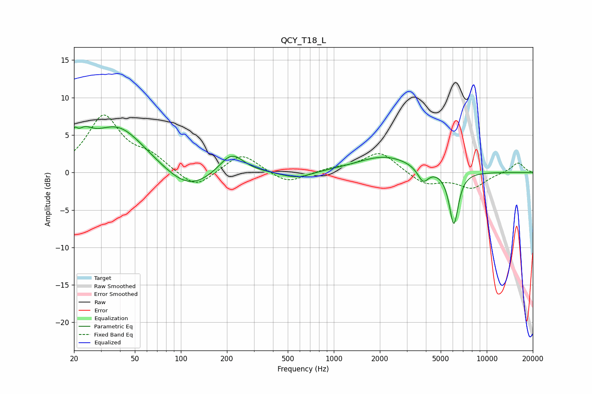

# QCY_T18_L
See [usage instructions](https://github.com/jaakkopasanen/AutoEq#usage) for more options and info.

### Parametric EQs
Apply preamp of -6.2 dB when using parametric equalizer.

|   # | Type    |   Fc (Hz) |    Q |   Gain (dB) |
|-----|---------|-----------|------|-------------|
|   1 | Peaking |        20 | 5.95 |         3.1 |
|   2 | Peaking |        21 | 5.69 |        -1.6 |
|   3 | Peaking |        23 | 2.46 |         2.4 |
|   4 | Peaking |        39 | 0.78 |         6.1 |
|   5 | Peaking |       111 | 0.91 |        -2.9 |
|   6 | Peaking |       214 | 1.75 |         2.9 |
|   7 | Peaking |       572 | 1.46 |        -0.9 |
|   8 | Peaking |      2160 | 0.76 |         2.2 |
|   9 | Peaking |      3833 | 4    |        -2   |
|  10 | Peaking |      6091 | 4.53 |        -7.2 |

### Fixed Band EQs
When using fixed band (also called graphic) equalizer, apply preamp of **-7.8 dB** (if available) and set gains manually with these parameters.

|   # | Type    |   Fc (Hz) |    Q |   Gain (dB) |
|-----|---------|-----------|------|-------------|
|   1 | Peaking |        31 | 1.41 |         7.4 |
|   2 | Peaking |        62 | 1.41 |         1.8 |
|   3 | Peaking |       125 | 1.41 |        -2.4 |
|   4 | Peaking |       250 | 1.41 |         2.6 |
|   5 | Peaking |       500 | 1.41 |        -1.6 |
|   6 | Peaking |      1000 | 1.41 |         0.5 |
|   7 | Peaking |      2000 | 1.41 |         2.8 |
|   8 | Peaking |      4000 | 1.41 |        -1.6 |
|   9 | Peaking |      8000 | 1.41 |        -2   |
|  10 | Peaking |     16000 | 1.41 |         1.4 |

### Graphs

