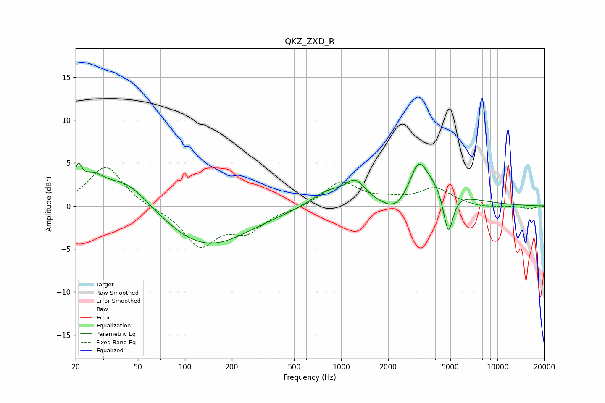

# QKZ_ZXD_R
See [usage instructions](https://github.com/jaakkopasanen/AutoEq#usage) for more options and info.

### Parametric EQs
Apply preamp of -5.1 dB when using parametric equalizer.

|   # | Type    |   Fc (Hz) |    Q |   Gain (dB) |
|-----|---------|-----------|------|-------------|
|   1 | Peaking |        21 | 5.97 |         2.8 |
|   2 | Peaking |        25 | 1.98 |         2.3 |
|   3 | Peaking |        42 | 0.89 |         3.5 |
|   4 | Peaking |       136 | 0.52 |        -4.8 |
|   5 | Peaking |       819 | 1.3  |         1.6 |
|   6 | Peaking |      1229 | 2.33 |         2.2 |
|   7 | Peaking |      2297 | 1.37 |        -3.8 |
|   8 | Peaking |      3120 | 3.1  |         2.4 |
|   9 | Peaking |      3130 | 0.84 |         4.7 |
|  10 | Peaking |      4844 | 4.37 |        -5.3 |

### Fixed Band EQs
When using fixed band (also called graphic) equalizer, apply preamp of **-4.6 dB** (if available) and set gains manually with these parameters.

|   # | Type    |   Fc (Hz) |    Q |   Gain (dB) |
|-----|---------|-----------|------|-------------|
|   1 | Peaking |        31 | 1.41 |         4.7 |
|   2 | Peaking |        62 | 1.41 |        -0.2 |
|   3 | Peaking |       125 | 1.41 |        -4.5 |
|   4 | Peaking |       250 | 1.41 |        -2.6 |
|   5 | Peaking |       500 | 1.41 |        -0.3 |
|   6 | Peaking |      1000 | 1.41 |         2.8 |
|   7 | Peaking |      2000 | 1.41 |         0.6 |
|   8 | Peaking |      4000 | 1.41 |         2   |
|   9 | Peaking |      8000 | 1.41 |        -0.2 |
|  10 | Peaking |     16000 | 1.41 |        -0.3 |

### Graphs

