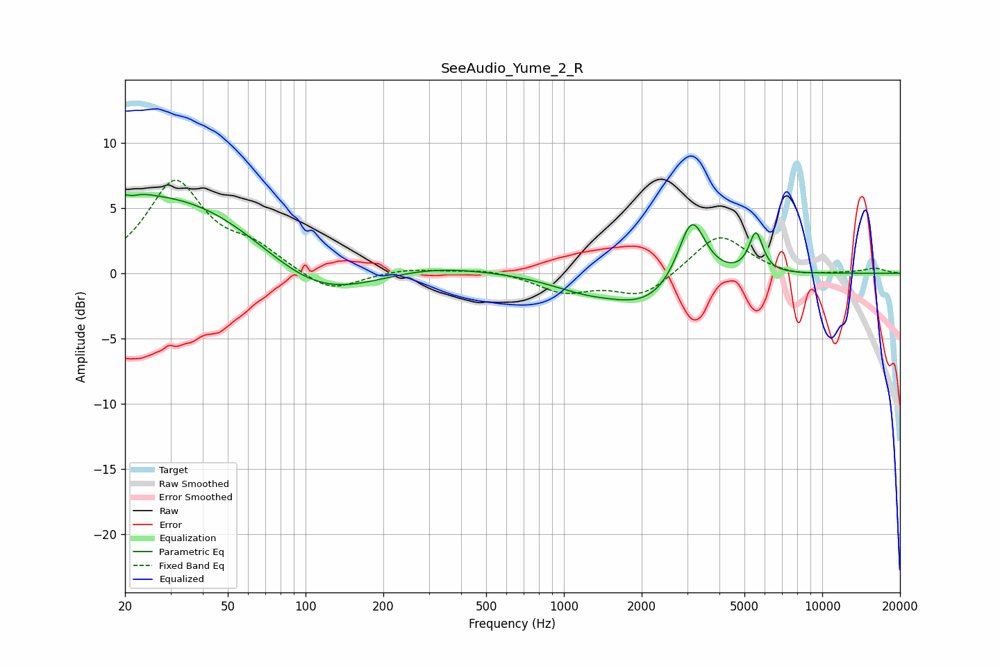

# SeeAudio_Yume_2_R
See [usage instructions](https://github.com/jaakkopasanen/AutoEq#usage) for more options and info.

### Parametric EQs
Apply preamp of -6.1 dB when using parametric equalizer.

|   # | Type    |   Fc (Hz) |    Q |   Gain (dB) |
|-----|---------|-----------|------|-------------|
|   1 | Peaking |        20 | 1.93 |         1.2 |
|   2 | Peaking |        21 | 5.79 |        -2.9 |
|   3 | Peaking |        21 | 5.85 |         2.6 |
|   4 | Peaking |        32 | 0.36 |         6.1 |
|   5 | Peaking |       108 | 0.62 |        -3.6 |
|   6 | Peaking |       299 | 0.66 |         0.8 |
|   7 | Peaking |      1188 | 1.07 |        -0.9 |
|   8 | Peaking |      2110 | 0.95 |        -2.3 |
|   9 | Peaking |      3125 | 2.65 |         5.2 |
|  10 | Peaking |      5537 | 5.21 |         3.1 |

### Fixed Band EQs
When using fixed band (also called graphic) equalizer, apply preamp of **-7.2 dB** (if available) and set gains manually with these parameters.

|   # | Type    |   Fc (Hz) |    Q |   Gain (dB) |
|-----|---------|-----------|------|-------------|
|   1 | Peaking |        31 | 1.41 |         6.9 |
|   2 | Peaking |        62 | 1.41 |         1.6 |
|   3 | Peaking |       125 | 1.41 |        -1.6 |
|   4 | Peaking |       250 | 1.41 |         0.4 |
|   5 | Peaking |       500 | 1.41 |         0.3 |
|   6 | Peaking |      1000 | 1.41 |        -1.4 |
|   7 | Peaking |      2000 | 1.41 |        -1.8 |
|   8 | Peaking |      4000 | 1.41 |         3.1 |
|   9 | Peaking |      8000 | 1.41 |        -0.3 |
|  10 | Peaking |     16000 | 1.41 |         0.4 |

### Graphs

