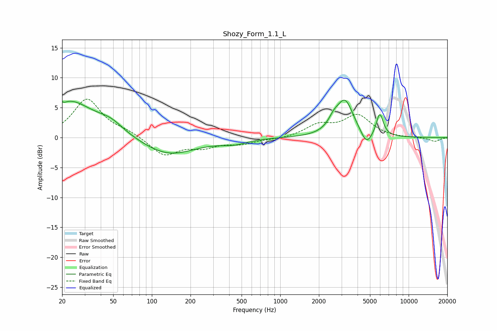

# Shozy_Form_1.1_L
See [usage instructions](https://github.com/jaakkopasanen/AutoEq#usage) for more options and info.

### Parametric EQs
Apply preamp of -6.3 dB when using parametric equalizer.

|   # | Type    |   Fc (Hz) |    Q |   Gain (dB) |
|-----|---------|-----------|------|-------------|
|   1 | Peaking |        20 | 5.78 |         3.3 |
|   2 | Peaking |        20 | 5.89 |        -3.4 |
|   3 | Peaking |        22 | 0.69 |         6.1 |
|   4 | Peaking |        48 | 1.46 |         1.5 |
|   5 | Peaking |       134 | 0.69 |        -3   |
|   6 | Peaking |       436 | 1.42 |        -0.8 |
|   7 | Peaking |      2608 | 3.53 |         1.4 |
|   8 | Peaking |      3196 | 2.11 |         6   |
|   9 | Peaking |      4694 | 3.21 |        -2.4 |
|  10 | Peaking |      5955 | 5.05 |         3.8 |

### Fixed Band EQs
When using fixed band (also called graphic) equalizer, apply preamp of **-6.5 dB** (if available) and set gains manually with these parameters.

|   # | Type    |   Fc (Hz) |    Q |   Gain (dB) |
|-----|---------|-----------|------|-------------|
|   1 | Peaking |        31 | 1.41 |         6.4 |
|   2 | Peaking |        62 | 1.41 |         0.8 |
|   3 | Peaking |       125 | 1.41 |        -3   |
|   4 | Peaking |       250 | 1.41 |        -1.4 |
|   5 | Peaking |       500 | 1.41 |        -0.9 |
|   6 | Peaking |      1000 | 1.41 |        -0.3 |
|   7 | Peaking |      2000 | 1.41 |         2   |
|   8 | Peaking |      4000 | 1.41 |         3.6 |
|   9 | Peaking |      8000 | 1.41 |        -0.1 |
|  10 | Peaking |     16000 | 1.41 |        -0.7 |

### Graphs

