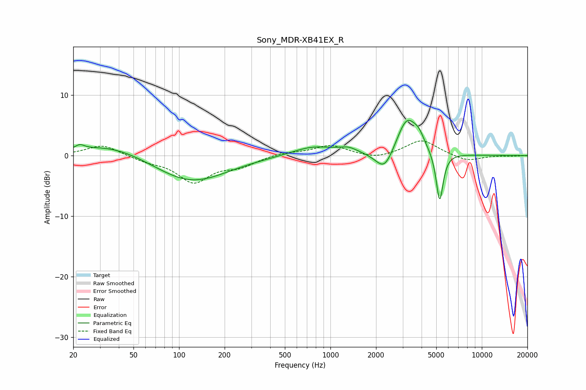

# Sony_MDR-XB41EX_R
See [usage instructions](https://github.com/jaakkopasanen/AutoEq#usage) for more options and info.

### Parametric EQs
Apply preamp of -5.9 dB when using parametric equalizer.

|   # | Type    |   Fc (Hz) |    Q |   Gain (dB) |
|-----|---------|-----------|------|-------------|
|   1 | Peaking |        22 | 4.77 |         0.7 |
|   2 | Peaking |        36 | 0.61 |         2.1 |
|   3 | Peaking |       118 | 0.59 |        -4.5 |
|   4 | Peaking |       167 | 1.19 |        -0.1 |
|   5 | Peaking |       770 | 0.99 |         1.6 |
|   6 | Peaking |      1314 | 2.38 |         0.8 |
|   7 | Peaking |      2279 | 2.37 |        -3.6 |
|   8 | Peaking |      3201 | 2.02 |         6.3 |
|   9 | Peaking |      3846 | 3.98 |         1.5 |
|  10 | Peaking |      5265 | 6    |        -8.4 |

### Fixed Band EQs
When using fixed band (also called graphic) equalizer, apply preamp of **-2.5 dB** (if available) and set gains manually with these parameters.

|   # | Type    |   Fc (Hz) |    Q |   Gain (dB) |
|-----|---------|-----------|------|-------------|
|   1 | Peaking |        31 | 1.41 |         1.8 |
|   2 | Peaking |        62 | 1.41 |        -0.8 |
|   3 | Peaking |       125 | 1.41 |        -4.2 |
|   4 | Peaking |       250 | 1.41 |        -1.5 |
|   5 | Peaking |       500 | 1.41 |         0.5 |
|   6 | Peaking |      1000 | 1.41 |         1.7 |
|   7 | Peaking |      2000 | 1.41 |        -0.7 |
|   8 | Peaking |      4000 | 1.41 |         2.6 |
|   9 | Peaking |      8000 | 1.41 |        -1   |
|  10 | Peaking |     16000 | 1.41 |        -0.1 |

### Graphs

