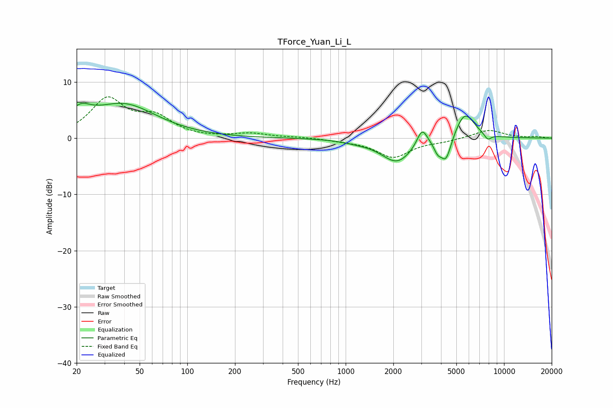

# TForce_Yuan_Li_L
See [usage instructions](https://github.com/jaakkopasanen/AutoEq#usage) for more options and info.

### Parametric EQs
Apply preamp of -6.3 dB when using parametric equalizer.

|   # | Type    |   Fc (Hz) |    Q |   Gain (dB) |
|-----|---------|-----------|------|-------------|
|   1 | Peaking |        21 | 2.04 |         2.9 |
|   2 | Peaking |        40 | 0.68 |         5.8 |
|   3 | Peaking |      1242 | 1.4  |        -0.4 |
|   4 | Peaking |      1395 | 3.24 |         0.1 |
|   5 | Peaking |      2113 | 1.44 |        -4.2 |
|   6 | Peaking |      3041 | 4.27 |         3.2 |
|   7 | Peaking |      3805 | 5.98 |        -1.6 |
|   8 | Peaking |      4300 | 4.04 |        -4.4 |
|   9 | Peaking |      5650 | 2.22 |         4.9 |
|  10 | Peaking |      7889 | 5.94 |        -1.1 |

### Fixed Band EQs
When using fixed band (also called graphic) equalizer, apply preamp of **-7.4 dB** (if available) and set gains manually with these parameters.

|   # | Type    |   Fc (Hz) |    Q |   Gain (dB) |
|-----|---------|-----------|------|-------------|
|   1 | Peaking |        31 | 1.41 |         6.7 |
|   2 | Peaking |        62 | 1.41 |         3.3 |
|   3 | Peaking |       125 | 1.41 |        -0   |
|   4 | Peaking |       250 | 1.41 |         0.8 |
|   5 | Peaking |       500 | 1.41 |         0.2 |
|   6 | Peaking |      1000 | 1.41 |        -0.4 |
|   7 | Peaking |      2000 | 1.41 |        -3.3 |
|   8 | Peaking |      4000 | 1.41 |        -0.5 |
|   9 | Peaking |      8000 | 1.41 |         1.5 |
|  10 | Peaking |     16000 | 1.41 |         0.2 |

### Graphs

