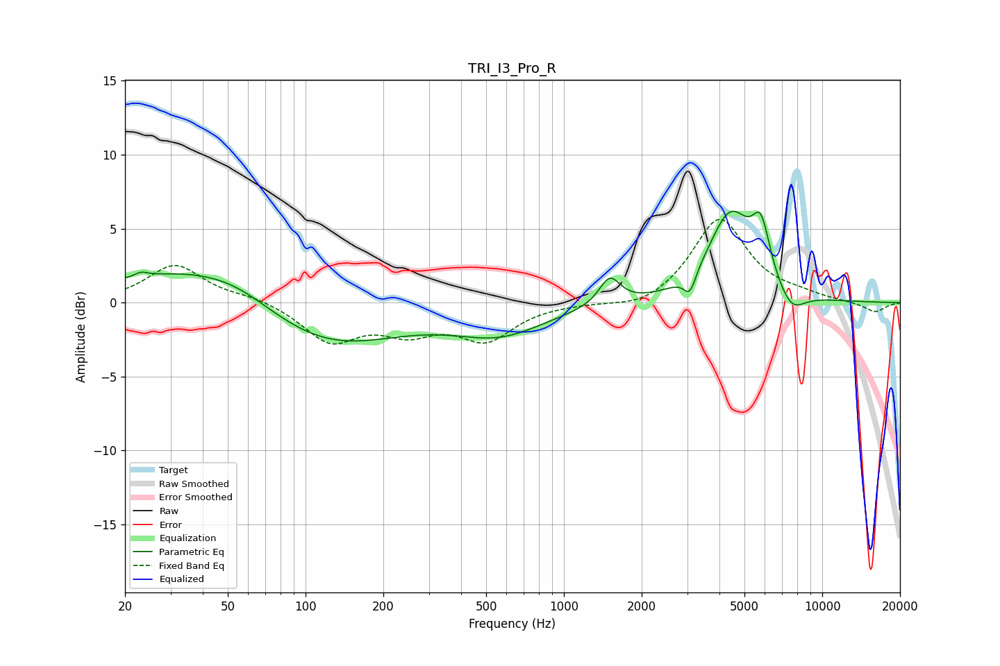

# TRI_I3_Pro_R
See [usage instructions](https://github.com/jaakkopasanen/AutoEq#usage) for more options and info.

### Parametric EQs
Apply preamp of -6.3 dB when using parametric equalizer.

|   # | Type    |   Fc (Hz) |    Q |   Gain (dB) |
|-----|---------|-----------|------|-------------|
|   1 | Peaking |        23 | 5.84 |         0.3 |
|   2 | Peaking |        36 | 0.45 |         2.4 |
|   3 | Peaking |        54 | 0.91 |         0.9 |
|   4 | Peaking |       115 | 0.5  |        -3.4 |
|   5 | Peaking |       565 | 0.79 |        -1.9 |
|   6 | Peaking |      1505 | 3.49 |         1.9 |
|   7 | Peaking |      3073 | 6    |        -1.4 |
|   8 | Peaking |      4412 | 1.64 |         5.8 |
|   9 | Peaking |      5795 | 3.97 |         3.5 |
|  10 | Peaking |      7588 | 2.53 |        -1.5 |

### Fixed Band EQs
When using fixed band (also called graphic) equalizer, apply preamp of **-5.7 dB** (if available) and set gains manually with these parameters.

|   # | Type    |   Fc (Hz) |    Q |   Gain (dB) |
|-----|---------|-----------|------|-------------|
|   1 | Peaking |        31 | 1.41 |         2.5 |
|   2 | Peaking |        62 | 1.41 |         0.4 |
|   3 | Peaking |       125 | 1.41 |        -2.5 |
|   4 | Peaking |       250 | 1.41 |        -1.7 |
|   5 | Peaking |       500 | 1.41 |        -2.4 |
|   6 | Peaking |      1000 | 1.41 |        -0   |
|   7 | Peaking |      2000 | 1.41 |        -0.6 |
|   8 | Peaking |      4000 | 1.41 |         5.7 |
|   9 | Peaking |      8000 | 1.41 |         0.4 |
|  10 | Peaking |     16000 | 1.41 |        -0.7 |

### Graphs

