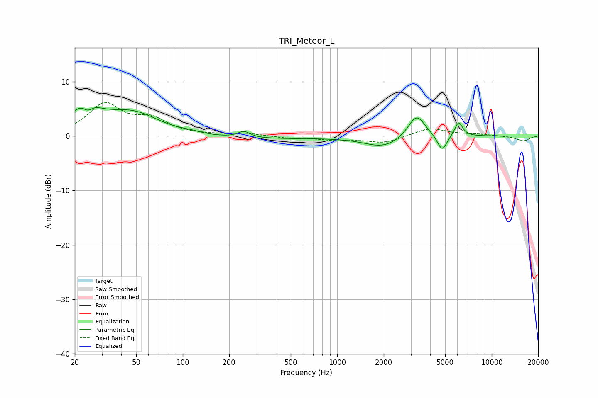

# TRI_Meteor_L
See [usage instructions](https://github.com/jaakkopasanen/AutoEq#usage) for more options and info.

### Parametric EQs
Apply preamp of -5.3 dB when using parametric equalizer.

|   # | Type    |   Fc (Hz) |    Q |   Gain (dB) |
|-----|---------|-----------|------|-------------|
|   1 | Peaking |        23 | 1.61 |         5   |
|   2 | Peaking |        24 | 4.26 |        -1.9 |
|   3 | Peaking |        47 | 0.8  |         4.2 |
|   4 | Peaking |       114 | 2.29 |         0.3 |
|   5 | Peaking |       249 | 3.69 |         1.1 |
|   6 | Peaking |       253 | 0.29 |        -0.6 |
|   7 | Peaking |      1997 | 1.15 |        -2.1 |
|   8 | Peaking |      3265 | 2.52 |         4.4 |
|   9 | Peaking |      4779 | 4.46 |        -3   |
|  10 | Peaking |      6105 | 5.4  |         2.7 |

### Fixed Band EQs
When using fixed band (also called graphic) equalizer, apply preamp of **-6.3 dB** (if available) and set gains manually with these parameters.

|   # | Type    |   Fc (Hz) |    Q |   Gain (dB) |
|-----|---------|-----------|------|-------------|
|   1 | Peaking |        31 | 1.41 |         5.7 |
|   2 | Peaking |        62 | 1.41 |         2.7 |
|   3 | Peaking |       125 | 1.41 |         0.1 |
|   4 | Peaking |       250 | 1.41 |         0.5 |
|   5 | Peaking |       500 | 1.41 |        -0.4 |
|   6 | Peaking |      1000 | 1.41 |        -0.7 |
|   7 | Peaking |      2000 | 1.41 |        -1.2 |
|   8 | Peaking |      4000 | 1.41 |         1.5 |
|   9 | Peaking |      8000 | 1.41 |         0.3 |
|  10 | Peaking |     16000 | 1.41 |        -0.9 |

### Graphs

