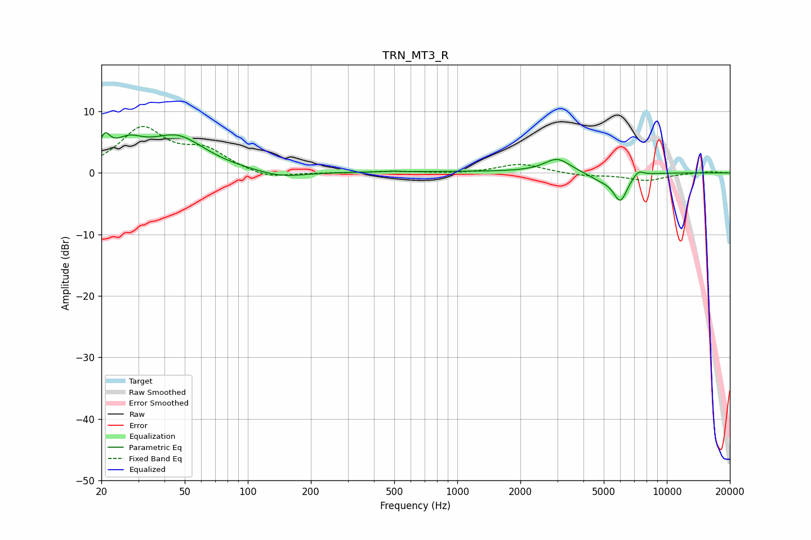

# TRN_MT3_R
See [usage instructions](https://github.com/jaakkopasanen/AutoEq#usage) for more options and info.

### Parametric EQs
Apply preamp of -6.6 dB when using parametric equalizer.

|   # | Type    |   Fc (Hz) |    Q |   Gain (dB) |
|-----|---------|-----------|------|-------------|
|   1 | Peaking |        21 | 5.48 |         3.4 |
|   2 | Peaking |        27 | 1.9  |         3.4 |
|   3 | Peaking |        46 | 1.04 |         5.5 |
|   4 | Peaking |       144 | 1.24 |        -1   |
|   5 | Peaking |       490 | 5.95 |         0.1 |
|   6 | Peaking |      1389 | 0.18 |         0.2 |
|   7 | Peaking |      3000 | 2.29 |         2.3 |
|   8 | Peaking |      4862 | 2.12 |        -1.1 |
|   9 | Peaking |      5999 | 4.08 |        -4.3 |
|  10 | Peaking |      7315 | 5.37 |         1   |

### Fixed Band EQs
When using fixed band (also called graphic) equalizer, apply preamp of **-7.7 dB** (if available) and set gains manually with these parameters.

|   # | Type    |   Fc (Hz) |    Q |   Gain (dB) |
|-----|---------|-----------|------|-------------|
|   1 | Peaking |        31 | 1.41 |         7   |
|   2 | Peaking |        62 | 1.41 |         3.3 |
|   3 | Peaking |       125 | 1.41 |        -1.1 |
|   4 | Peaking |       250 | 1.41 |        -0   |
|   5 | Peaking |       500 | 1.41 |         0.2 |
|   6 | Peaking |      1000 | 1.41 |        -0.2 |
|   7 | Peaking |      2000 | 1.41 |         1.5 |
|   8 | Peaking |      4000 | 1.41 |        -0.5 |
|   9 | Peaking |      8000 | 1.41 |        -1.2 |
|  10 | Peaking |     16000 | 1.41 |         0.2 |

### Graphs

