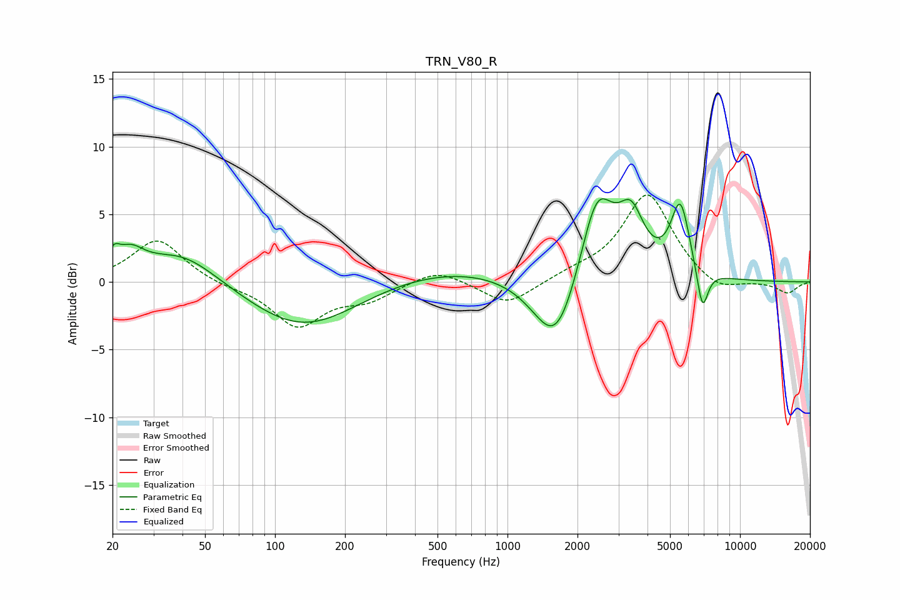

# TRN_V80_R
See [usage instructions](https://github.com/jaakkopasanen/AutoEq#usage) for more options and info.

### Parametric EQs
Apply preamp of -6.2 dB when using parametric equalizer.

|   # | Type    |   Fc (Hz) |    Q |   Gain (dB) |
|-----|---------|-----------|------|-------------|
|   1 | Peaking |        20 | 5.79 |         1.1 |
|   2 | Peaking |        24 | 2.41 |         1.6 |
|   3 | Peaking |        40 | 0.89 |         2.4 |
|   4 | Peaking |       133 | 0.6  |        -3.6 |
|   5 | Peaking |       568 | 0.41 |         1.2 |
|   6 | Peaking |      1621 | 1.44 |        -5.9 |
|   7 | Peaking |      2426 | 1.87 |         6.9 |
|   8 | Peaking |      3404 | 2.56 |         3.9 |
|   9 | Peaking |      5536 | 3.38 |         5.3 |
|  10 | Peaking |      6890 | 5.62 |        -3.3 |

### Fixed Band EQs
When using fixed band (also called graphic) equalizer, apply preamp of **-6.5 dB** (if available) and set gains manually with these parameters.

|   # | Type    |   Fc (Hz) |    Q |   Gain (dB) |
|-----|---------|-----------|------|-------------|
|   1 | Peaking |        31 | 1.41 |         3.2 |
|   2 | Peaking |        62 | 1.41 |        -0.3 |
|   3 | Peaking |       125 | 1.41 |        -3.2 |
|   4 | Peaking |       250 | 1.41 |        -1.2 |
|   5 | Peaking |       500 | 1.41 |         1.1 |
|   6 | Peaking |      1000 | 1.41 |        -1.8 |
|   7 | Peaking |      2000 | 1.41 |         0.5 |
|   8 | Peaking |      4000 | 1.41 |         6.5 |
|   9 | Peaking |      8000 | 1.41 |        -1   |
|  10 | Peaking |     16000 | 1.41 |        -0.8 |

### Graphs

