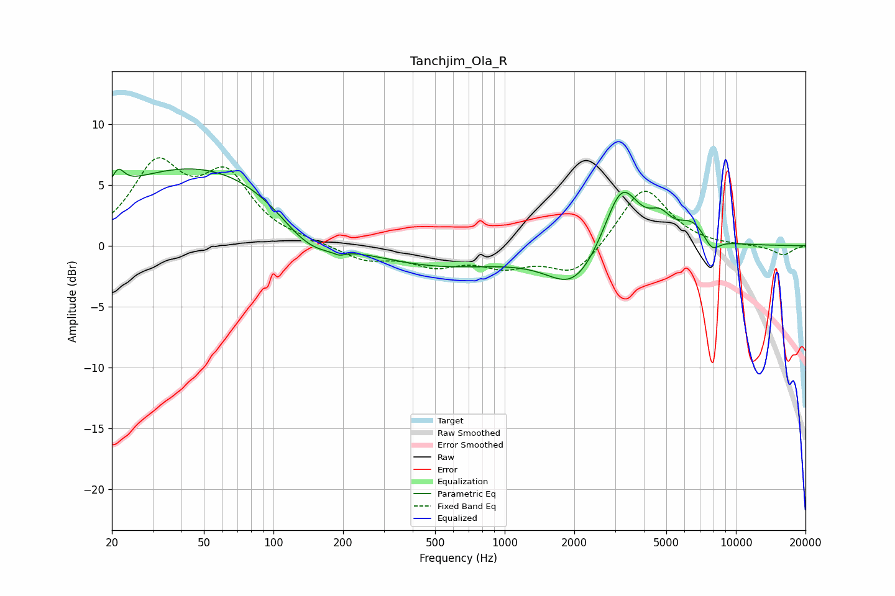

# Tanchjim_Ola_R
See [usage instructions](https://github.com/jaakkopasanen/AutoEq#usage) for more options and info.

### Parametric EQs
Apply preamp of -6.4 dB when using parametric equalizer.

|   # | Type    |   Fc (Hz) |    Q |   Gain (dB) |
|-----|---------|-----------|------|-------------|
|   1 | Peaking |        21 | 5.5  |         1.4 |
|   2 | Peaking |        52 | 0.3  |         6.8 |
|   3 | Peaking |       142 | 1.03 |        -3.2 |
|   4 | Peaking |       193 | 5.82 |        -0.3 |
|   5 | Peaking |       415 | 0.38 |        -2.1 |
|   6 | Peaking |      1999 | 1.24 |        -3.4 |
|   7 | Peaking |      3204 | 1.88 |         5.5 |
|   8 | Peaking |      4695 | 2.97 |         1.5 |
|   9 | Peaking |      6470 | 2.15 |         1.6 |
|  10 | Peaking |      7863 | 3.88 |        -1.1 |

### Fixed Band EQs
When using fixed band (also called graphic) equalizer, apply preamp of **-7.3 dB** (if available) and set gains manually with these parameters.

|   # | Type    |   Fc (Hz) |    Q |   Gain (dB) |
|-----|---------|-----------|------|-------------|
|   1 | Peaking |        31 | 1.41 |         6.2 |
|   2 | Peaking |        62 | 1.41 |         5.2 |
|   3 | Peaking |       125 | 1.41 |         0.2 |
|   4 | Peaking |       250 | 1.41 |        -1.2 |
|   5 | Peaking |       500 | 1.41 |        -1.4 |
|   6 | Peaking |      1000 | 1.41 |        -1.5 |
|   7 | Peaking |      2000 | 1.41 |        -2.5 |
|   8 | Peaking |      4000 | 1.41 |         5   |
|   9 | Peaking |      8000 | 1.41 |        -0   |
|  10 | Peaking |     16000 | 1.41 |        -0.8 |

### Graphs

