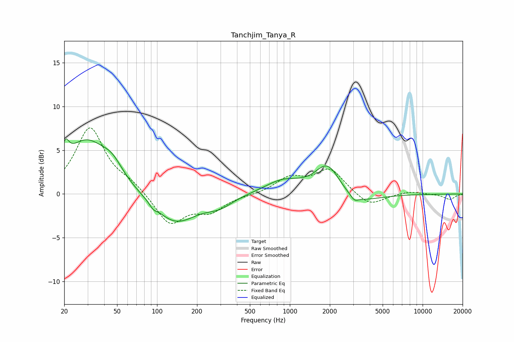

# Tanchjim_Tanya_R
See [usage instructions](https://github.com/jaakkopasanen/AutoEq#usage) for more options and info.

### Parametric EQs
Apply preamp of -6.4 dB when using parametric equalizer.

|   # | Type    |   Fc (Hz) |    Q |   Gain (dB) |
|-----|---------|-----------|------|-------------|
|   1 | Peaking |        20 | 5.44 |         2   |
|   2 | Peaking |        29 | 0.86 |         5.9 |
|   3 | Peaking |        46 | 1.81 |         1.6 |
|   4 | Peaking |        93 | 5.91 |        -0.4 |
|   5 | Peaking |       137 | 0.88 |        -3.4 |
|   6 | Peaking |       296 | 1.42 |        -1   |
|   7 | Peaking |       887 | 1.03 |         1.5 |
|   8 | Peaking |      1929 | 1.5  |         3.6 |
|   9 | Peaking |      3067 | 5.2  |        -0.6 |
|  10 | Peaking |      3072 | 0.91 |        -1.4 |

### Fixed Band EQs
When using fixed band (also called graphic) equalizer, apply preamp of **-7.6 dB** (if available) and set gains manually with these parameters.

|   # | Type    |   Fc (Hz) |    Q |   Gain (dB) |
|-----|---------|-----------|------|-------------|
|   1 | Peaking |        31 | 1.41 |         7.5 |
|   2 | Peaking |        62 | 1.41 |         1   |
|   3 | Peaking |       125 | 1.41 |        -3.5 |
|   4 | Peaking |       250 | 1.41 |        -1.8 |
|   5 | Peaking |       500 | 1.41 |        -0.1 |
|   6 | Peaking |      1000 | 1.41 |         1.7 |
|   7 | Peaking |      2000 | 1.41 |         2.8 |
|   8 | Peaking |      4000 | 1.41 |        -1.5 |
|   9 | Peaking |      8000 | 1.41 |         0.3 |
|  10 | Peaking |     16000 | 1.41 |        -0.6 |

### Graphs

