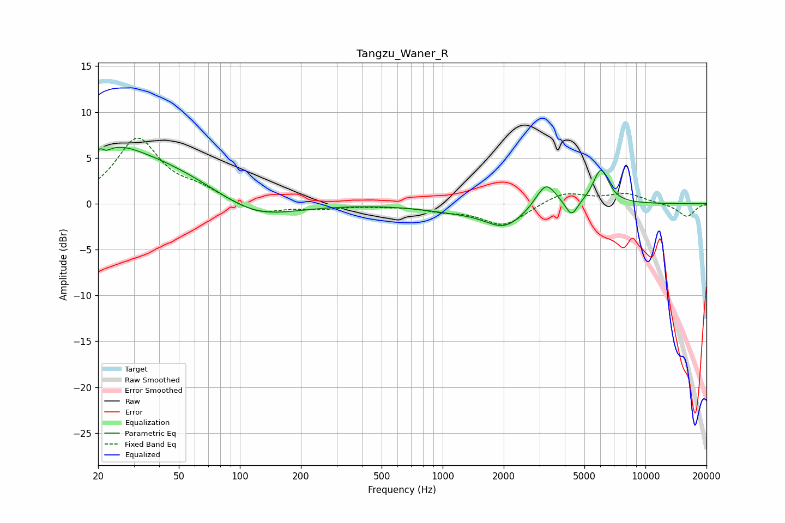

# Tangzu_Waner_R
See [usage instructions](https://github.com/jaakkopasanen/AutoEq#usage) for more options and info.

### Parametric EQs
Apply preamp of -6.2 dB when using parametric equalizer.

|   # | Type    |   Fc (Hz) |    Q |   Gain (dB) |
|-----|---------|-----------|------|-------------|
|   1 | Peaking |        21 | 5.85 |         3.2 |
|   2 | Peaking |        21 | 5.94 |        -3.2 |
|   3 | Peaking |        25 | 1.34 |         1.1 |
|   4 | Peaking |        27 | 0.37 |         5.3 |
|   5 | Peaking |       118 | 0.74 |        -2.3 |
|   6 | Peaking |      1116 | 0.88 |        -0.6 |
|   7 | Peaking |      2024 | 1.43 |        -2.4 |
|   8 | Peaking |      3230 | 2.8  |         2.8 |
|   9 | Peaking |      4322 | 4.72 |        -1.8 |
|  10 | Peaking |      6033 | 3.58 |         3.8 |

### Fixed Band EQs
When using fixed band (also called graphic) equalizer, apply preamp of **-7.2 dB** (if available) and set gains manually with these parameters.

|   # | Type    |   Fc (Hz) |    Q |   Gain (dB) |
|-----|---------|-----------|------|-------------|
|   1 | Peaking |        31 | 1.41 |         7   |
|   2 | Peaking |        62 | 1.41 |         1.3 |
|   3 | Peaking |       125 | 1.41 |        -1.2 |
|   4 | Peaking |       250 | 1.41 |        -0.5 |
|   5 | Peaking |       500 | 1.41 |        -0.1 |
|   6 | Peaking |      1000 | 1.41 |        -0.6 |
|   7 | Peaking |      2000 | 1.41 |        -2.4 |
|   8 | Peaking |      4000 | 1.41 |         1.3 |
|   9 | Peaking |      8000 | 1.41 |         1.1 |
|  10 | Peaking |     16000 | 1.41 |        -1.4 |

### Graphs

