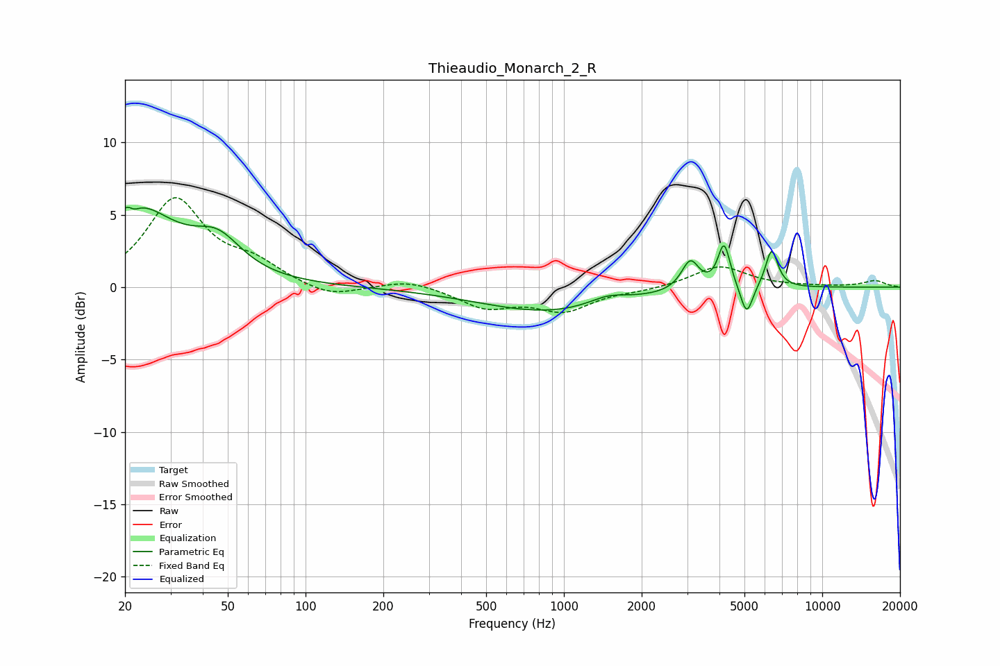

# Thieaudio_Monarch_2_R
See [usage instructions](https://github.com/jaakkopasanen/AutoEq#usage) for more options and info.

### Parametric EQs
Apply preamp of -5.6 dB when using parametric equalizer.

|   # | Type    |   Fc (Hz) |    Q |   Gain (dB) |
|-----|---------|-----------|------|-------------|
|   1 | Peaking |        21 | 5.95 |         3.2 |
|   2 | Peaking |        21 | 5.96 |        -3.3 |
|   3 | Peaking |        22 | 0.9  |         5.3 |
|   4 | Peaking |        46 | 1.54 |         2.3 |
|   5 | Peaking |       892 | 0.52 |        -1.7 |
|   6 | Peaking |      1482 | 1.83 |         0.6 |
|   7 | Peaking |      3084 | 4.21 |         2   |
|   8 | Peaking |      4170 | 5.99 |         3.1 |
|   9 | Peaking |      5098 | 5.94 |        -2.1 |
|  10 | Peaking |      6370 | 5.79 |         2.7 |

### Fixed Band EQs
When using fixed band (also called graphic) equalizer, apply preamp of **-6.3 dB** (if available) and set gains manually with these parameters.

|   # | Type    |   Fc (Hz) |    Q |   Gain (dB) |
|-----|---------|-----------|------|-------------|
|   1 | Peaking |        31 | 1.41 |         6   |
|   2 | Peaking |        62 | 1.41 |         1.4 |
|   3 | Peaking |       125 | 1.41 |        -0.8 |
|   4 | Peaking |       250 | 1.41 |         0.5 |
|   5 | Peaking |       500 | 1.41 |        -1.3 |
|   6 | Peaking |      1000 | 1.41 |        -1.5 |
|   7 | Peaking |      2000 | 1.41 |        -0.2 |
|   8 | Peaking |      4000 | 1.41 |         1.5 |
|   9 | Peaking |      8000 | 1.41 |         0   |
|  10 | Peaking |     16000 | 1.41 |         0.4 |

### Graphs

