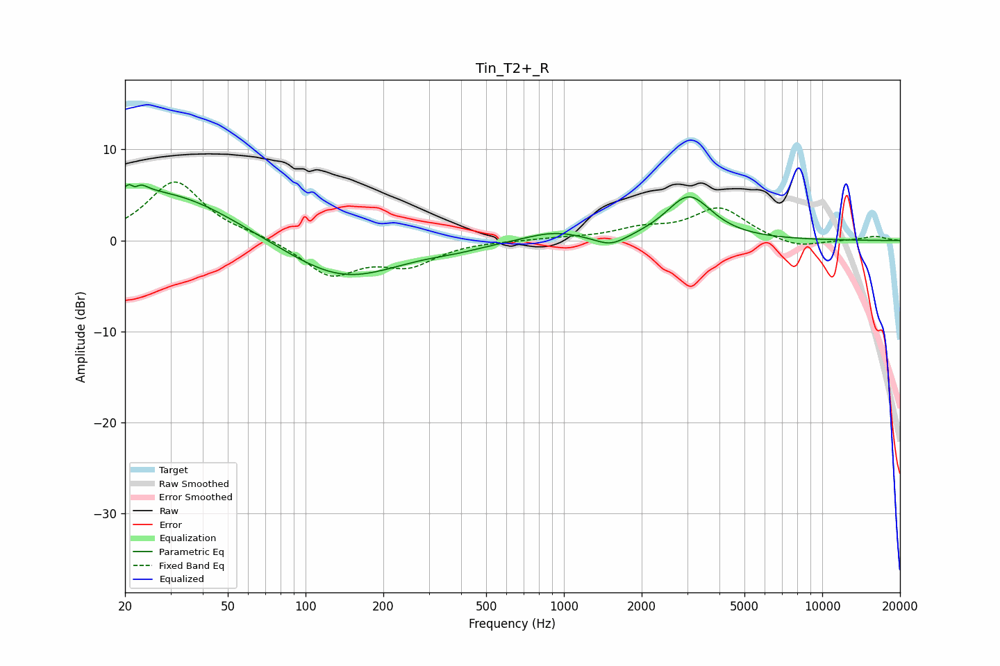

# Tin_T2+_R
See [usage instructions](https://github.com/jaakkopasanen/AutoEq#usage) for more options and info.

### Parametric EQs
Apply preamp of -6.2 dB when using parametric equalizer.

|   # | Type    |   Fc (Hz) |    Q |   Gain (dB) |
|-----|---------|-----------|------|-------------|
|   1 | Peaking |        21 | 5.7  |         3.4 |
|   2 | Peaking |        21 | 1.78 |         1.4 |
|   3 | Peaking |        21 | 6    |        -3.1 |
|   4 | Peaking |        23 | 5.91 |         0.8 |
|   5 | Peaking |        31 | 0.57 |         5   |
|   6 | Peaking |       139 | 0.64 |        -4.4 |
|   7 | Peaking |       388 | 1.39 |        -0.4 |
|   8 | Peaking |       912 | 1.25 |         1   |
|   9 | Peaking |      1519 | 2.21 |        -1.2 |
|  10 | Peaking |      3048 | 1.61 |         4.8 |

### Fixed Band EQs
When using fixed band (also called graphic) equalizer, apply preamp of **-6.5 dB** (if available) and set gains manually with these parameters.

|   # | Type    |   Fc (Hz) |    Q |   Gain (dB) |
|-----|---------|-----------|------|-------------|
|   1 | Peaking |        31 | 1.41 |         6.5 |
|   2 | Peaking |        62 | 1.41 |         0.4 |
|   3 | Peaking |       125 | 1.41 |        -3.8 |
|   4 | Peaking |       250 | 1.41 |        -2.5 |
|   5 | Peaking |       500 | 1.41 |         0   |
|   6 | Peaking |      1000 | 1.41 |         0.2 |
|   7 | Peaking |      2000 | 1.41 |         1.1 |
|   8 | Peaking |      4000 | 1.41 |         3.5 |
|   9 | Peaking |      8000 | 1.41 |        -0.9 |
|  10 | Peaking |     16000 | 1.41 |         0.5 |

### Graphs

