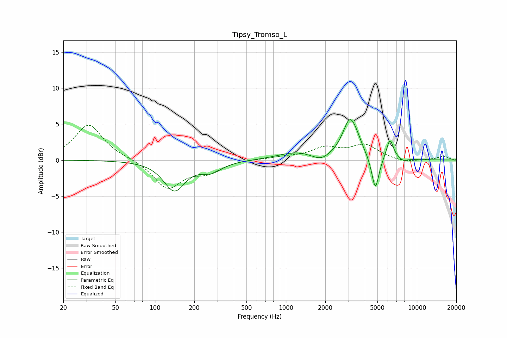

# Tipsy_Tromso_L
See [usage instructions](https://github.com/jaakkopasanen/AutoEq#usage) for more options and info.

### Parametric EQs
Apply preamp of -5.7 dB when using parametric equalizer.

|   # | Type    |   Fc (Hz) |    Q |   Gain (dB) |
|-----|---------|-----------|------|-------------|
|   1 | Peaking |       141 | 1.74 |        -4.1 |
|   2 | Peaking |       270 | 1.78 |        -1.4 |
|   3 | Peaking |      1083 | 1.11 |         0.8 |
|   4 | Peaking |      1312 | 1.85 |         0.3 |
|   5 | Peaking |      1856 | 2.43 |        -0.7 |
|   6 | Peaking |      3092 | 2.48 |         5.6 |
|   7 | Peaking |      3538 | 4.37 |         0.5 |
|   8 | Peaking |      4819 | 4.99 |        -4.8 |
|   9 | Peaking |      6230 | 5.09 |         2.9 |
|  10 | Peaking |      7919 | 4.97 |        -0.4 |

### Fixed Band EQs
When using fixed band (also called graphic) equalizer, apply preamp of **-4.9 dB** (if available) and set gains manually with these parameters.

|   # | Type    |   Fc (Hz) |    Q |   Gain (dB) |
|-----|---------|-----------|------|-------------|
|   1 | Peaking |        31 | 1.41 |         4.9 |
|   2 | Peaking |        62 | 1.41 |         0.2 |
|   3 | Peaking |       125 | 1.41 |        -3.9 |
|   4 | Peaking |       250 | 1.41 |        -1.5 |
|   5 | Peaking |       500 | 1.41 |         0.1 |
|   6 | Peaking |      1000 | 1.41 |         0.4 |
|   7 | Peaking |      2000 | 1.41 |         1.6 |
|   8 | Peaking |      4000 | 1.41 |         2   |
|   9 | Peaking |      8000 | 1.41 |        -0.4 |
|  10 | Peaking |     16000 | 1.41 |         0.5 |

### Graphs

