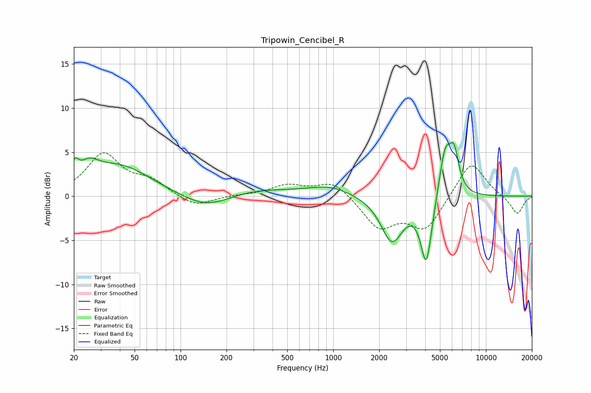

# Tripowin_Cencibel_R
See [usage instructions](https://github.com/jaakkopasanen/AutoEq#usage) for more options and info.

### Parametric EQs
Apply preamp of -6.2 dB when using parametric equalizer.

|   # | Type    |   Fc (Hz) |    Q |   Gain (dB) |
|-----|---------|-----------|------|-------------|
|   1 | Peaking |        20 | 5.99 |         1.7 |
|   2 | Peaking |        25 | 2.2  |         1.8 |
|   3 | Peaking |        40 | 0.69 |         3.4 |
|   4 | Peaking |       149 | 0.87 |        -1.8 |
|   5 | Peaking |       291 | 0.56 |         0.9 |
|   6 | Peaking |       955 | 0.98 |         1.1 |
|   7 | Peaking |      2423 | 1.95 |        -5.1 |
|   8 | Peaking |      4071 | 3.79 |        -7.6 |
|   9 | Peaking |      5399 | 3.48 |         5.5 |
|  10 | Peaking |      6190 | 4.34 |         4.1 |

### Fixed Band EQs
When using fixed band (also called graphic) equalizer, apply preamp of **-5.0 dB** (if available) and set gains manually with these parameters.

|   # | Type    |   Fc (Hz) |    Q |   Gain (dB) |
|-----|---------|-----------|------|-------------|
|   1 | Peaking |        31 | 1.41 |         4.7 |
|   2 | Peaking |        62 | 1.41 |         1.6 |
|   3 | Peaking |       125 | 1.41 |        -1.3 |
|   4 | Peaking |       250 | 1.41 |         0.1 |
|   5 | Peaking |       500 | 1.41 |         1.2 |
|   6 | Peaking |      1000 | 1.41 |         1.8 |
|   7 | Peaking |      2000 | 1.41 |        -3.5 |
|   8 | Peaking |      4000 | 1.41 |        -3.7 |
|   9 | Peaking |      8000 | 1.41 |         4.1 |
|  10 | Peaking |     16000 | 1.41 |        -2.1 |

### Graphs

