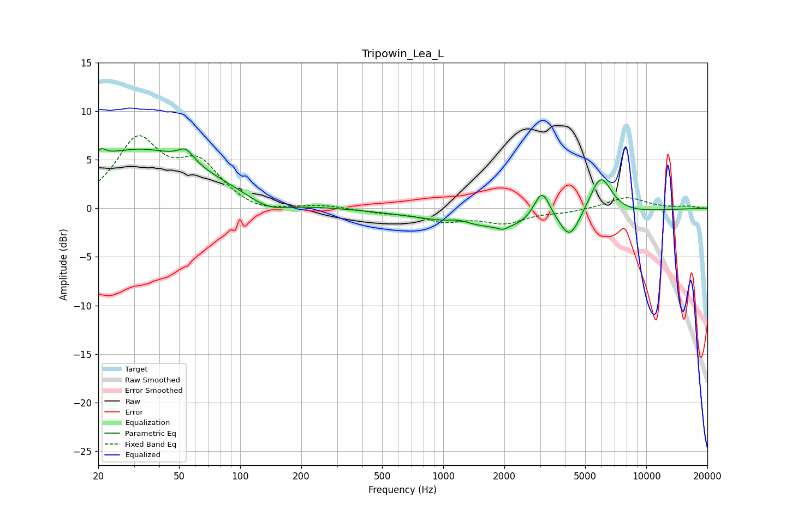

# Tripowin_Lea_L
See [usage instructions](https://github.com/jaakkopasanen/AutoEq#usage) for more options and info.

### Parametric EQs
Apply preamp of -6.2 dB when using parametric equalizer.

|   # | Type    |   Fc (Hz) |    Q |   Gain (dB) |
|-----|---------|-----------|------|-------------|
|   1 | Peaking |        21 | 5.96 |         0.9 |
|   2 | Peaking |        32 | 0.42 |         6   |
|   3 | Peaking |        54 | 3.68 |         1.3 |
|   4 | Peaking |       137 | 1.34 |        -1.3 |
|   5 | Peaking |      1197 | 2.87 |         0.4 |
|   6 | Peaking |      1971 | 5.73 |        -0.4 |
|   7 | Peaking |      2311 | 0.38 |        -2.2 |
|   8 | Peaking |      3067 | 3.31 |         3.6 |
|   9 | Peaking |      4208 | 3.2  |        -2.3 |
|  10 | Peaking |      5954 | 2.43 |         4.3 |

### Fixed Band EQs
When using fixed band (also called graphic) equalizer, apply preamp of **-7.6 dB** (if available) and set gains manually with these parameters.

|   # | Type    |   Fc (Hz) |    Q |   Gain (dB) |
|-----|---------|-----------|------|-------------|
|   1 | Peaking |        31 | 1.41 |         6.7 |
|   2 | Peaking |        62 | 1.41 |         4.1 |
|   3 | Peaking |       125 | 1.41 |        -0.7 |
|   4 | Peaking |       250 | 1.41 |         0.3 |
|   5 | Peaking |       500 | 1.41 |        -0.4 |
|   6 | Peaking |      1000 | 1.41 |        -1.2 |
|   7 | Peaking |      2000 | 1.41 |        -1.4 |
|   8 | Peaking |      4000 | 1.41 |        -0.3 |
|   9 | Peaking |      8000 | 1.41 |         1.2 |
|  10 | Peaking |     16000 | 1.41 |         0.2 |

### Graphs

