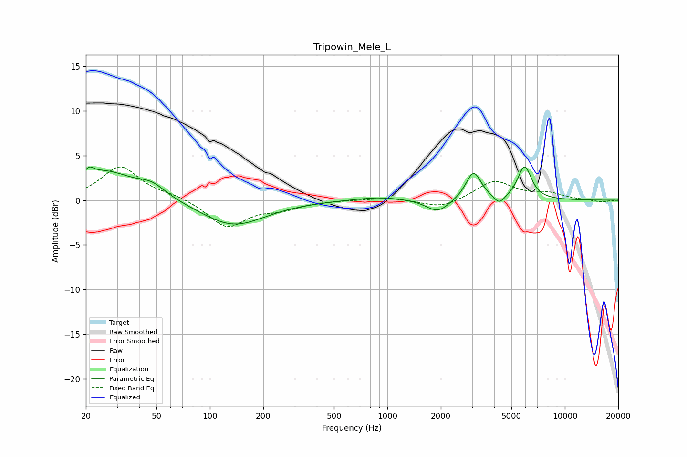

# Tripowin_Mele_L
See [usage instructions](https://github.com/jaakkopasanen/AutoEq#usage) for more options and info.

### Parametric EQs
Apply preamp of -3.8 dB when using parametric equalizer.

|   # | Type    |   Fc (Hz) |    Q |   Gain (dB) |
|-----|---------|-----------|------|-------------|
|   1 | Peaking |        21 | 5.87 |         3.2 |
|   2 | Peaking |        21 | 5.98 |        -2.4 |
|   3 | Peaking |        25 | 0.83 |         3.2 |
|   4 | Peaking |        47 | 1.83 |         1.2 |
|   5 | Peaking |       135 | 0.79 |        -2.9 |
|   6 | Peaking |       894 | 1.01 |         0.4 |
|   7 | Peaking |      1923 | 2.21 |        -1.5 |
|   8 | Peaking |      3056 | 3.3  |         3.2 |
|   9 | Peaking |      4270 | 4.43 |        -1   |
|  10 | Peaking |      5926 | 3.57 |         3.7 |

### Fixed Band EQs
When using fixed band (also called graphic) equalizer, apply preamp of **-3.8 dB** (if available) and set gains manually with these parameters.

|   # | Type    |   Fc (Hz) |    Q |   Gain (dB) |
|-----|---------|-----------|------|-------------|
|   1 | Peaking |        31 | 1.41 |         3.7 |
|   2 | Peaking |        62 | 1.41 |         0.5 |
|   3 | Peaking |       125 | 1.41 |        -3   |
|   4 | Peaking |       250 | 1.41 |        -0.8 |
|   5 | Peaking |       500 | 1.41 |         0   |
|   6 | Peaking |      1000 | 1.41 |         0.3 |
|   7 | Peaking |      2000 | 1.41 |        -0.9 |
|   8 | Peaking |      4000 | 1.41 |         2.1 |
|   9 | Peaking |      8000 | 1.41 |         0.7 |
|  10 | Peaking |     16000 | 1.41 |        -0.2 |

### Graphs

