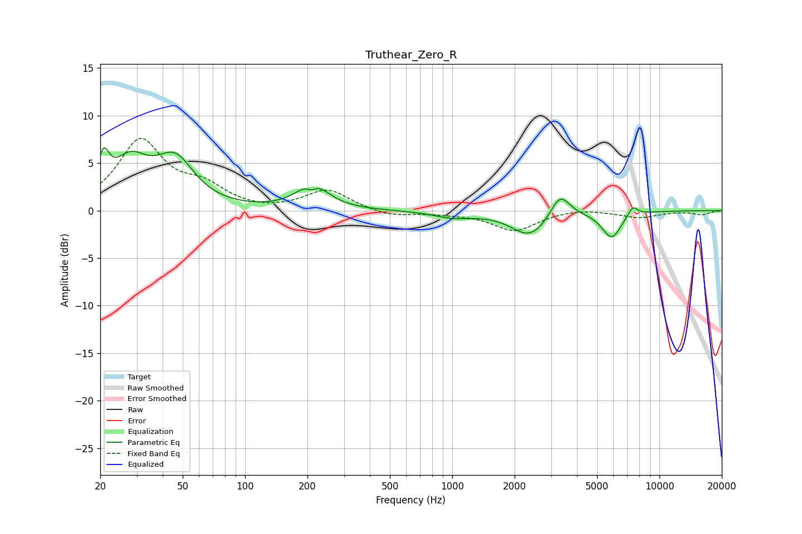

# Truthear_Zero_R
See [usage instructions](https://github.com/jaakkopasanen/AutoEq#usage) for more options and info.

### Parametric EQs
Apply preamp of -6.7 dB when using parametric equalizer.

|   # | Type    |   Fc (Hz) |    Q |   Gain (dB) |
|-----|---------|-----------|------|-------------|
|   1 | Peaking |        21 | 5.3  |         3.6 |
|   2 | Peaking |        28 | 1.59 |         4.5 |
|   3 | Peaking |        46 | 1.53 |         4.8 |
|   4 | Peaking |       209 | 5.96 |        -0.7 |
|   5 | Peaking |       211 | 1.95 |         2.8 |
|   6 | Peaking |      1009 | 1.51 |        -0.6 |
|   7 | Peaking |      2372 | 1.59 |        -2.7 |
|   8 | Peaking |      3317 | 3.03 |         2.5 |
|   9 | Peaking |      5879 | 2.95 |        -2.8 |
|  10 | Peaking |      7431 | 5.72 |         1.1 |

### Fixed Band EQs
When using fixed band (also called graphic) equalizer, apply preamp of **-7.7 dB** (if available) and set gains manually with these parameters.

|   # | Type    |   Fc (Hz) |    Q |   Gain (dB) |
|-----|---------|-----------|------|-------------|
|   1 | Peaking |        31 | 1.41 |         7.2 |
|   2 | Peaking |        62 | 1.41 |         2.1 |
|   3 | Peaking |       125 | 1.41 |        -0.2 |
|   4 | Peaking |       250 | 1.41 |         2.2 |
|   5 | Peaking |       500 | 1.41 |        -0.7 |
|   6 | Peaking |      1000 | 1.41 |        -0.2 |
|   7 | Peaking |      2000 | 1.41 |        -2.1 |
|   8 | Peaking |      4000 | 1.41 |         0.3 |
|   9 | Peaking |      8000 | 1.41 |        -0.7 |
|  10 | Peaking |     16000 | 1.41 |        -0.4 |

### Graphs

