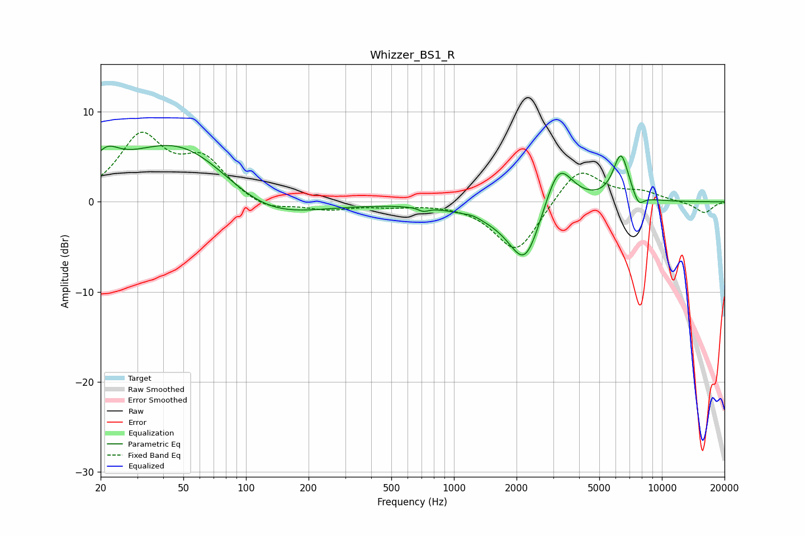

# Whizzer_BS1_R
See [usage instructions](https://github.com/jaakkopasanen/AutoEq#usage) for more options and info.

### Parametric EQs
Apply preamp of -6.4 dB when using parametric equalizer.

|   # | Type    |   Fc (Hz) |    Q |   Gain (dB) |
|-----|---------|-----------|------|-------------|
|   1 | Peaking |        21 | 2.35 |         2.4 |
|   2 | Peaking |        49 | 0.49 |         7.5 |
|   3 | Peaking |       118 | 0.6  |        -3.8 |
|   4 | Peaking |       712 | 5.99 |        -0.4 |
|   5 | Peaking |      1233 | 3.93 |         0.3 |
|   6 | Peaking |      1632 | 0.79 |        -1.2 |
|   7 | Peaking |      2201 | 1.85 |        -6.5 |
|   8 | Peaking |      3179 | 2.04 |         5.5 |
|   9 | Peaking |      6354 | 3.59 |         5.2 |
|  10 | Peaking |      7713 | 5.03 |        -1.4 |

### Fixed Band EQs
When using fixed band (also called graphic) equalizer, apply preamp of **-7.8 dB** (if available) and set gains manually with these parameters.

|   # | Type    |   Fc (Hz) |    Q |   Gain (dB) |
|-----|---------|-----------|------|-------------|
|   1 | Peaking |        31 | 1.41 |         7   |
|   2 | Peaking |        62 | 1.41 |         4.2 |
|   3 | Peaking |       125 | 1.41 |        -1.1 |
|   4 | Peaking |       250 | 1.41 |        -0.8 |
|   5 | Peaking |       500 | 1.41 |        -0.4 |
|   6 | Peaking |      1000 | 1.41 |        -0   |
|   7 | Peaking |      2000 | 1.41 |        -5.8 |
|   8 | Peaking |      4000 | 1.41 |         4   |
|   9 | Peaking |      8000 | 1.41 |         0.9 |
|  10 | Peaking |     16000 | 1.41 |        -1.3 |

### Graphs

