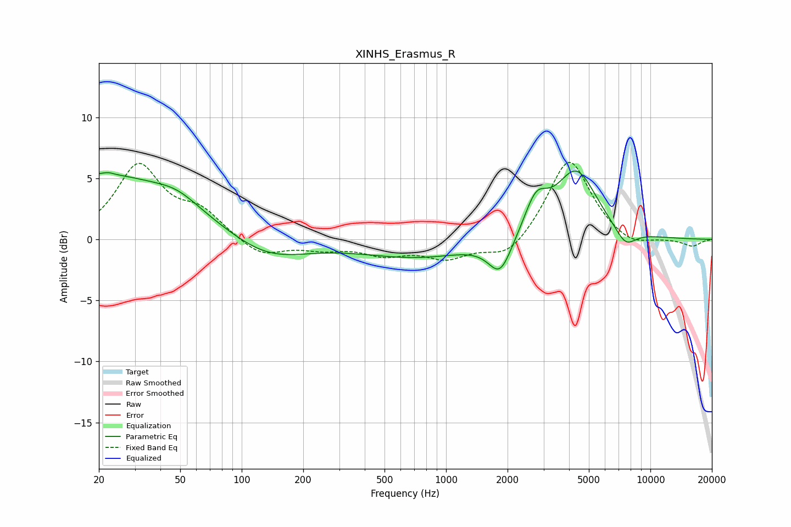

# XINHS_Erasmus_R
See [usage instructions](https://github.com/jaakkopasanen/AutoEq#usage) for more options and info.

### Parametric EQs
Apply preamp of -5.7 dB when using parametric equalizer.

|   # | Type    |   Fc (Hz) |    Q |   Gain (dB) |
|-----|---------|-----------|------|-------------|
|   1 | Peaking |        20 | 0.34 |         5.3 |
|   2 | Peaking |        22 | 6    |        -2.9 |
|   3 | Peaking |        22 | 5.94 |         3   |
|   4 | Peaking |        48 | 1.36 |         0.9 |
|   5 | Peaking |       133 | 0.74 |        -1.9 |
|   6 | Peaking |       727 | 0.51 |        -1.4 |
|   7 | Peaking |      1840 | 2.49 |        -2.9 |
|   8 | Peaking |      2754 | 2.51 |         2.8 |
|   9 | Peaking |      4336 | 1.37 |         5.6 |
|  10 | Peaking |      7552 | 2.6  |        -1.5 |

### Fixed Band EQs
When using fixed band (also called graphic) equalizer, apply preamp of **-6.4 dB** (if available) and set gains manually with these parameters.

|   # | Type    |   Fc (Hz) |    Q |   Gain (dB) |
|-----|---------|-----------|------|-------------|
|   1 | Peaking |        31 | 1.41 |         5.9 |
|   2 | Peaking |        62 | 1.41 |         2   |
|   3 | Peaking |       125 | 1.41 |        -1.4 |
|   4 | Peaking |       250 | 1.41 |        -0.7 |
|   5 | Peaking |       500 | 1.41 |        -1.1 |
|   6 | Peaking |      1000 | 1.41 |        -1.4 |
|   7 | Peaking |      2000 | 1.41 |        -1.7 |
|   8 | Peaking |      4000 | 1.41 |         6.8 |
|   9 | Peaking |      8000 | 1.41 |        -0.8 |
|  10 | Peaking |     16000 | 1.41 |        -0.6 |

### Graphs

