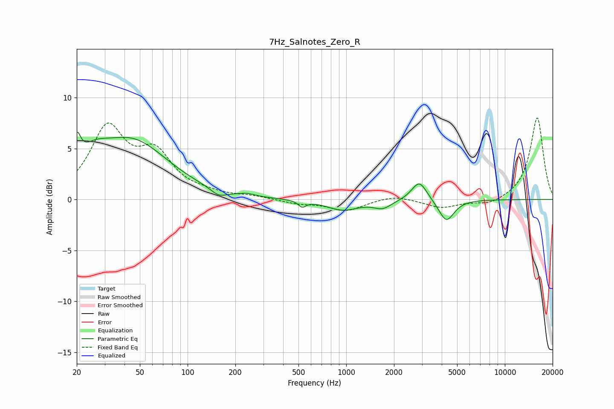

# 7Hz_Salnotes_Zero_R
See [usage instructions](https://github.com/jaakkopasanen/AutoEq#usage) for more options and info.

### Parametric EQs
Apply preamp of -6.7 dB when using parametric equalizer.

|   # | Type    |   Fc (Hz) |    Q |   Gain (dB) |
|-----|---------|-----------|------|-------------|
|   1 | Peaking |        20 | 5.95 |         2.8 |
|   2 | Peaking |        25 | 1.45 |         2   |
|   3 | Peaking |        45 | 0.63 |         5.5 |
|   4 | Peaking |       157 | 2.79 |        -0.7 |
|   5 | Peaking |       237 | 3.13 |         0.2 |
|   6 | Peaking |       528 | 5.97 |        -0.6 |
|   7 | Peaking |       949 | 1.4  |        -1   |
|   8 | Peaking |      1696 | 2.55 |        -0.8 |
|   9 | Peaking |      2890 | 2.93 |         2   |
|  10 | Peaking |      4279 | 2.94 |        -2.2 |

### Fixed Band EQs
When using fixed band (also called graphic) equalizer, apply preamp of **-8.1 dB** (if available) and set gains manually with these parameters.

|   # | Type    |   Fc (Hz) |    Q |   Gain (dB) |
|-----|---------|-----------|------|-------------|
|   1 | Peaking |        31 | 1.41 |         6.7 |
|   2 | Peaking |        62 | 1.41 |         4   |
|   3 | Peaking |       125 | 1.41 |         0.4 |
|   4 | Peaking |       250 | 1.41 |         0.3 |
|   5 | Peaking |       500 | 1.41 |        -0.4 |
|   6 | Peaking |      1000 | 1.41 |        -1.1 |
|   7 | Peaking |      2000 | 1.41 |         0.5 |
|   8 | Peaking |      4000 | 1.41 |        -0.8 |
|   9 | Peaking |      8000 | 1.41 |        -0.6 |
|  10 | Peaking |     16000 | 1.41 |         8.1 |

### Graphs

