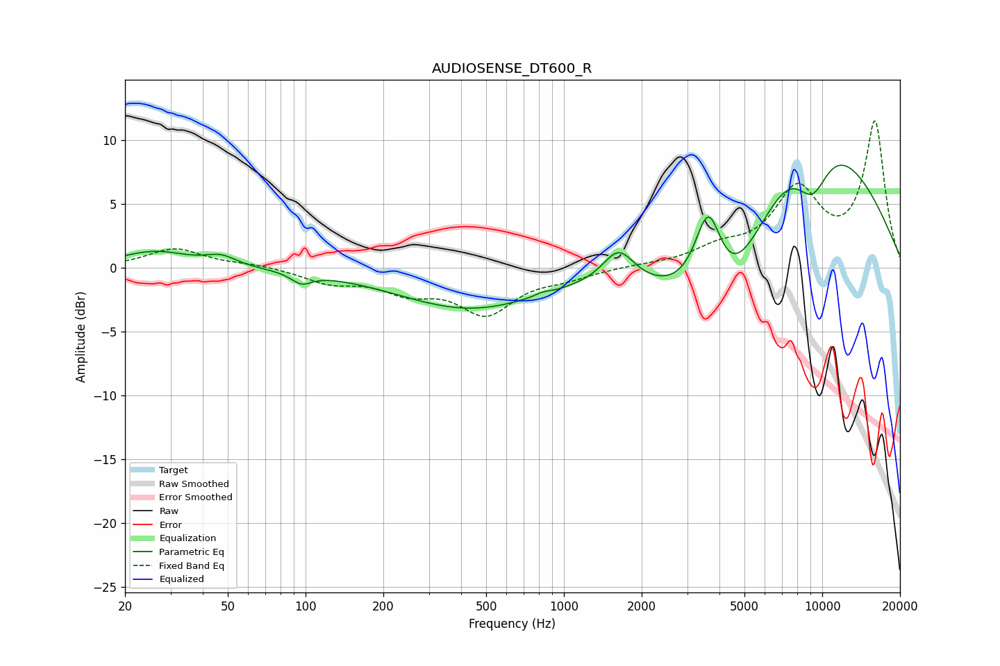

# AUDIOSENSE_DT600_R
See [usage instructions](https://github.com/jaakkopasanen/AutoEq#usage) for more options and info.

### Parametric EQs
Apply preamp of -8.1 dB when using parametric equalizer.

|   # | Type    |   Fc (Hz) |    Q |   Gain (dB) |
|-----|---------|-----------|------|-------------|
|   1 | Peaking |        26 | 1.07 |         1.3 |
|   2 | Peaking |        47 | 2.49 |         0.7 |
|   3 | Peaking |        96 | 3.58 |        -0.8 |
|   4 | Peaking |       430 | 0.51 |        -3.1 |
|   5 | Peaking |       824 | 5.56 |         0.2 |
|   6 | Peaking |      1629 | 2.33 |         2.7 |
|   7 | Peaking |      3625 | 2.41 |         8   |
|   8 | Peaking |      4077 | 0.72 |       -11.5 |
|   9 | Peaking |      8519 | 0.43 |        14.3 |
|  10 | Peaking |      9142 | 1.76 |        -5   |

### Fixed Band EQs
When using fixed band (also called graphic) equalizer, apply preamp of **-11.6 dB** (if available) and set gains manually with these parameters.

|   # | Type    |   Fc (Hz) |    Q |   Gain (dB) |
|-----|---------|-----------|------|-------------|
|   1 | Peaking |        31 | 1.41 |         1.5 |
|   2 | Peaking |        62 | 1.41 |         0.2 |
|   3 | Peaking |       125 | 1.41 |        -1   |
|   4 | Peaking |       250 | 1.41 |        -1.6 |
|   5 | Peaking |       500 | 1.41 |        -3.4 |
|   6 | Peaking |      1000 | 1.41 |        -0.6 |
|   7 | Peaking |      2000 | 1.41 |         0.1 |
|   8 | Peaking |      4000 | 1.41 |         1.3 |
|   9 | Peaking |      8000 | 1.41 |         5.7 |
|  10 | Peaking |     16000 | 1.41 |        11.3 |

### Graphs

