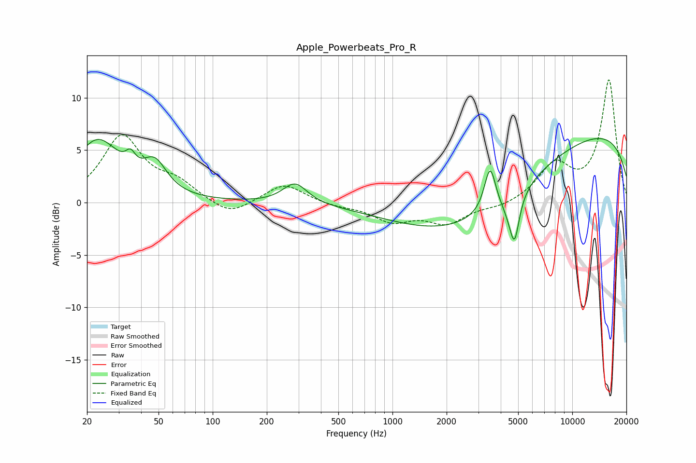

# Apple_Powerbeats_Pro_R
See [usage instructions](https://github.com/jaakkopasanen/AutoEq#usage) for more options and info.

### Parametric EQs
Apply preamp of -6.2 dB when using parametric equalizer.

|   # | Type    |   Fc (Hz) |    Q |   Gain (dB) |
|-----|---------|-----------|------|-------------|
|   1 | Peaking |        23 | 1.12 |         5.8 |
|   2 | Peaking |        28 | 1.38 |        -0   |
|   3 | Peaking |        35 | 5.59 |         1.2 |
|   4 | Peaking |        48 | 2.14 |         2.8 |
|   5 | Peaking |       287 | 2.08 |         2   |
|   6 | Peaking |      2898 | 0.38 |        -6.1 |
|   7 | Peaking |      3490 | 4.49 |         4.2 |
|   8 | Peaking |      4611 | 2.95 |        -2   |
|   9 | Peaking |      4776 | 5.91 |        -3.2 |
|  10 | Peaking |     10000 | 0.18 |         7.3 |

### Fixed Band EQs
When using fixed band (also called graphic) equalizer, apply preamp of **-11.8 dB** (if available) and set gains manually with these parameters.

|   # | Type    |   Fc (Hz) |    Q |   Gain (dB) |
|-----|---------|-----------|------|-------------|
|   1 | Peaking |        31 | 1.41 |         6.2 |
|   2 | Peaking |        62 | 1.41 |         1.6 |
|   3 | Peaking |       125 | 1.41 |        -1.4 |
|   4 | Peaking |       250 | 1.41 |         1.8 |
|   5 | Peaking |       500 | 1.41 |        -0.3 |
|   6 | Peaking |      1000 | 1.41 |        -1.7 |
|   7 | Peaking |      2000 | 1.41 |        -1.9 |
|   8 | Peaking |      4000 | 1.41 |        -0.5 |
|   9 | Peaking |      8000 | 1.41 |         3.4 |
|  10 | Peaking |     16000 | 1.41 |        11.6 |

### Graphs

