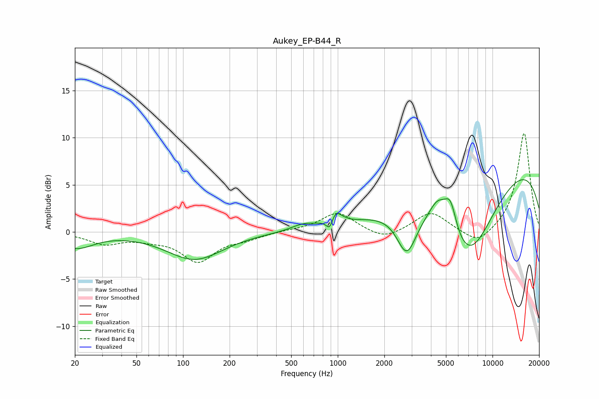

# Aukey_EP-B44_R
See [usage instructions](https://github.com/jaakkopasanen/AutoEq#usage) for more options and info.

### Parametric EQs
Apply preamp of -5.6 dB when using parametric equalizer.

|   # | Type    |   Fc (Hz) |    Q |   Gain (dB) |
|-----|---------|-----------|------|-------------|
|   1 | Peaking |        20 | 1.26 |        -1.6 |
|   2 | Peaking |       119 | 0.78 |        -2.9 |
|   3 | Peaking |       596 | 1.84 |         0.6 |
|   4 | Peaking |       889 | 6    |        -1.7 |
|   5 | Peaking |       948 | 3.49 |         1.9 |
|   6 | Peaking |      2791 | 2.21 |        -4.6 |
|   7 | Peaking |      4452 | 2.31 |         2.7 |
|   8 | Peaking |      5352 | 3.52 |         3.2 |
|   9 | Peaking |      6948 | 0.7  |       -10.1 |
|  10 | Peaking |     10000 | 0.2  |         8.3 |

### Fixed Band EQs
When using fixed band (also called graphic) equalizer, apply preamp of **-10.5 dB** (if available) and set gains manually with these parameters.

|   # | Type    |   Fc (Hz) |    Q |   Gain (dB) |
|-----|---------|-----------|------|-------------|
|   1 | Peaking |        31 | 1.41 |        -1.2 |
|   2 | Peaking |        62 | 1.41 |        -0.5 |
|   3 | Peaking |       125 | 1.41 |        -3   |
|   4 | Peaking |       250 | 1.41 |        -0.6 |
|   5 | Peaking |       500 | 1.41 |         0.1 |
|   6 | Peaking |      1000 | 1.41 |         2.1 |
|   7 | Peaking |      2000 | 1.41 |        -1   |
|   8 | Peaking |      4000 | 1.41 |         2.1 |
|   9 | Peaking |      8000 | 1.41 |        -1.5 |
|  10 | Peaking |     16000 | 1.41 |        10.6 |

### Graphs

