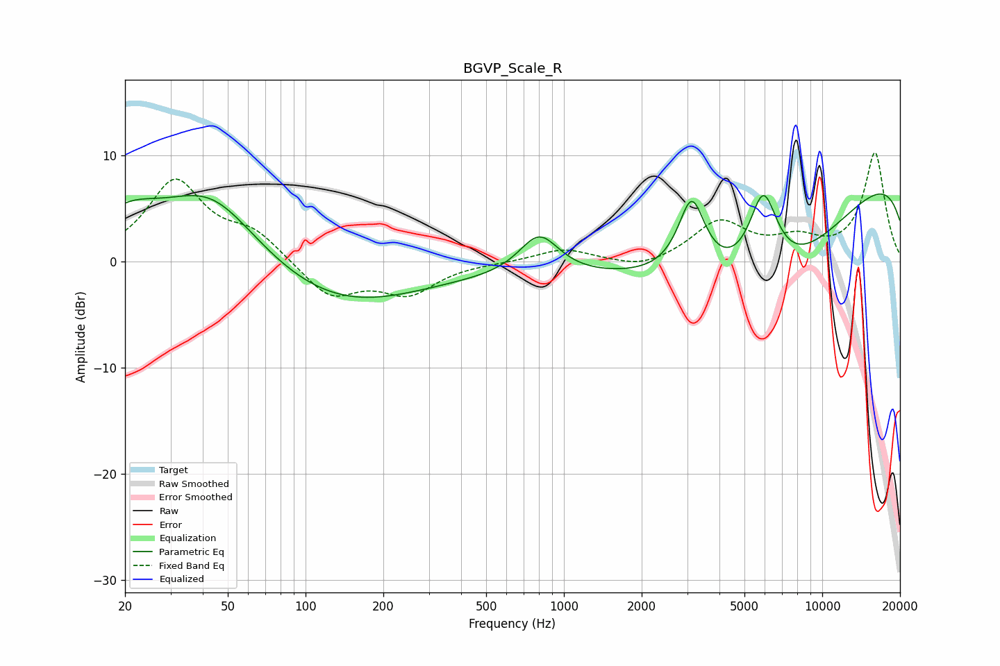

# BGVP_Scale_R
See [usage instructions](https://github.com/jaakkopasanen/AutoEq#usage) for more options and info.

### Parametric EQs
Apply preamp of -6.5 dB when using parametric equalizer.

|   # | Type    |   Fc (Hz) |    Q |   Gain (dB) |
|-----|---------|-----------|------|-------------|
|   1 | Peaking |        20 | 1.05 |         3.6 |
|   2 | Peaking |        43 | 0.58 |        11.2 |
|   3 | Peaking |        62 | 0.28 |        -6   |
|   4 | Peaking |       137 | 0.49 |        -1.6 |
|   5 | Peaking |       802 | 1.84 |         3.9 |
|   6 | Peaking |      1714 | 0.29 |        -1.7 |
|   7 | Peaking |      3124 | 2.7  |         7.2 |
|   8 | Peaking |      5914 | 2.39 |         8.1 |
|   9 | Peaking |      6315 | 0.36 |       -13   |
|  10 | Peaking |     10000 | 0.18 |        12.4 |

### Fixed Band EQs
When using fixed band (also called graphic) equalizer, apply preamp of **-10.4 dB** (if available) and set gains manually with these parameters.

|   # | Type    |   Fc (Hz) |    Q |   Gain (dB) |
|-----|---------|-----------|------|-------------|
|   1 | Peaking |        31 | 1.41 |         7.5 |
|   2 | Peaking |        62 | 1.41 |         2.4 |
|   3 | Peaking |       125 | 1.41 |        -3.4 |
|   4 | Peaking |       250 | 1.41 |        -2.8 |
|   5 | Peaking |       500 | 1.41 |        -0   |
|   6 | Peaking |      1000 | 1.41 |         1.2 |
|   7 | Peaking |      2000 | 1.41 |        -0.8 |
|   8 | Peaking |      4000 | 1.41 |         3.7 |
|   9 | Peaking |      8000 | 1.41 |         1.7 |
|  10 | Peaking |     16000 | 1.41 |        10.2 |

### Graphs

