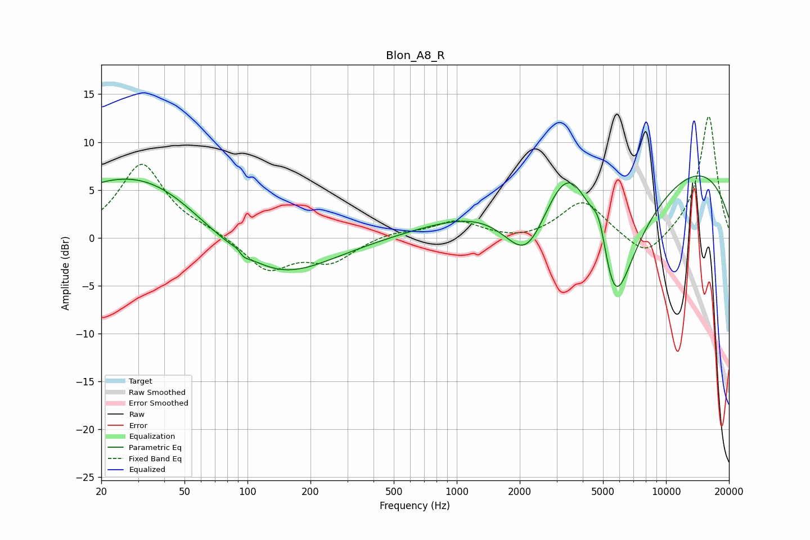

# Blon_A8_R
See [usage instructions](https://github.com/jaakkopasanen/AutoEq#usage) for more options and info.

### Parametric EQs
Apply preamp of -6.6 dB when using parametric equalizer.

|   # | Type    |   Fc (Hz) |    Q |   Gain (dB) |
|-----|---------|-----------|------|-------------|
|   1 | Peaking |        33 | 0.36 |         7.5 |
|   2 | Peaking |        67 | 0.72 |        -2   |
|   3 | Peaking |        91 | 5.92 |         0.8 |
|   4 | Peaking |        94 | 5.25 |        -1   |
|   5 | Peaking |       139 | 0.58 |        -5   |
|   6 | Peaking |      2166 | 1.19 |        -7.9 |
|   7 | Peaking |      3456 | 1.06 |         8.3 |
|   8 | Peaking |      4805 | 3.8  |         3.7 |
|   9 | Peaking |      5655 | 0.93 |       -20   |
|  10 | Peaking |      7126 | 0.18 |        11.5 |

### Fixed Band EQs
When using fixed band (also called graphic) equalizer, apply preamp of **-12.8 dB** (if available) and set gains manually with these parameters.

|   # | Type    |   Fc (Hz) |    Q |   Gain (dB) |
|-----|---------|-----------|------|-------------|
|   1 | Peaking |        31 | 1.41 |         7.7 |
|   2 | Peaking |        62 | 1.41 |         0.6 |
|   3 | Peaking |       125 | 1.41 |        -3.4 |
|   4 | Peaking |       250 | 1.41 |        -2.3 |
|   5 | Peaking |       500 | 1.41 |         0.6 |
|   6 | Peaking |      1000 | 1.41 |         1.7 |
|   7 | Peaking |      2000 | 1.41 |        -0.4 |
|   8 | Peaking |      4000 | 1.41 |         3.9 |
|   9 | Peaking |      8000 | 1.41 |        -2.5 |
|  10 | Peaking |     16000 | 1.41 |        12.9 |

### Graphs

