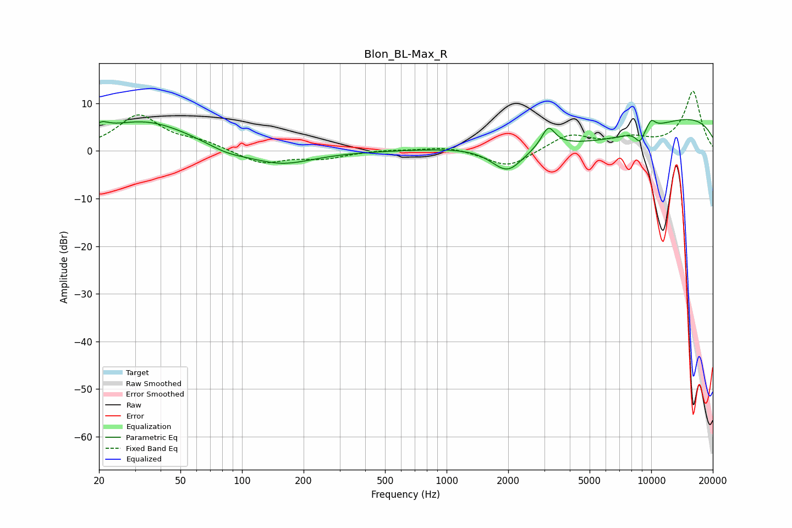

# Blon_BL-Max_R
See [usage instructions](https://github.com/jaakkopasanen/AutoEq#usage) for more options and info.

### Parametric EQs
Apply preamp of -6.7 dB when using parametric equalizer.

|   # | Type    |   Fc (Hz) |    Q |   Gain (dB) |
|-----|---------|-----------|------|-------------|
|   1 | Peaking |        20 | 3.91 |         1.7 |
|   2 | Peaking |        33 | 0.61 |         6.3 |
|   3 | Peaking |        84 | 1.41 |        -1.4 |
|   4 | Peaking |       154 | 0.9  |        -3.1 |
|   5 | Peaking |      1985 | 1.73 |        -5.9 |
|   6 | Peaking |      3142 | 4.3  |         4.2 |
|   7 | Peaking |      5628 | 0.42 |        -6   |
|   8 | Peaking |      8800 | 5.98 |        -2.5 |
|   9 | Peaking |      9538 | 0.18 |         9.2 |
|  10 | Peaking |     10000 | 6    |         1.9 |

### Fixed Band EQs
When using fixed band (also called graphic) equalizer, apply preamp of **-12.6 dB** (if available) and set gains manually with these parameters.

|   # | Type    |   Fc (Hz) |    Q |   Gain (dB) |
|-----|---------|-----------|------|-------------|
|   1 | Peaking |        31 | 1.41 |         7.4 |
|   2 | Peaking |        62 | 1.41 |         1.6 |
|   3 | Peaking |       125 | 1.41 |        -2.7 |
|   4 | Peaking |       250 | 1.41 |        -1.5 |
|   5 | Peaking |       500 | 1.41 |         0.3 |
|   6 | Peaking |      1000 | 1.41 |         1   |
|   7 | Peaking |      2000 | 1.41 |        -3.6 |
|   8 | Peaking |      4000 | 1.41 |         3.4 |
|   9 | Peaking |      8000 | 1.41 |         2.1 |
|  10 | Peaking |     16000 | 1.41 |        12.5 |

### Graphs

