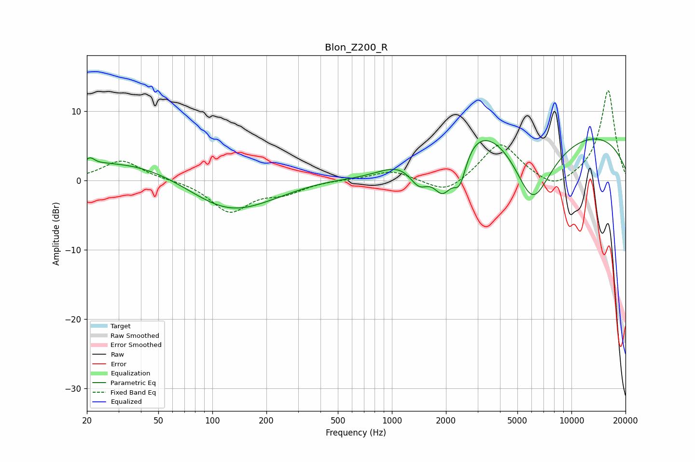

# Blon_Z200_R
See [usage instructions](https://github.com/jaakkopasanen/AutoEq#usage) for more options and info.

### Parametric EQs
Apply preamp of -6.1 dB when using parametric equalizer.

|   # | Type    |   Fc (Hz) |    Q |   Gain (dB) |
|-----|---------|-----------|------|-------------|
|   1 | Peaking |        21 | 5.36 |         1.1 |
|   2 | Peaking |        26 | 5.78 |         0   |
|   3 | Peaking |        62 | 0.29 |         5.4 |
|   4 | Peaking |       121 | 0.48 |        -8.7 |
|   5 | Peaking |       811 | 0.57 |        -5.8 |
|   6 | Peaking |      1422 | 2.22 |        -4.7 |
|   7 | Peaking |      1920 | 2.26 |        -7.2 |
|   8 | Peaking |      2386 | 3.61 |        -5.3 |
|   9 | Peaking |      4363 | 0.18 |        19.3 |
|  10 | Peaking |      6062 | 0.72 |       -20   |

### Fixed Band EQs
When using fixed band (also called graphic) equalizer, apply preamp of **-13.1 dB** (if available) and set gains manually with these parameters.

|   # | Type    |   Fc (Hz) |    Q |   Gain (dB) |
|-----|---------|-----------|------|-------------|
|   1 | Peaking |        31 | 1.41 |         3   |
|   2 | Peaking |        62 | 1.41 |         0.1 |
|   3 | Peaking |       125 | 1.41 |        -4.4 |
|   4 | Peaking |       250 | 1.41 |        -1.5 |
|   5 | Peaking |       500 | 1.41 |         0.1 |
|   6 | Peaking |      1000 | 1.41 |         1.5 |
|   7 | Peaking |      2000 | 1.41 |        -2.1 |
|   8 | Peaking |      4000 | 1.41 |         5.6 |
|   9 | Peaking |      8000 | 1.41 |        -1.7 |
|  10 | Peaking |     16000 | 1.41 |        13.1 |

### Graphs

