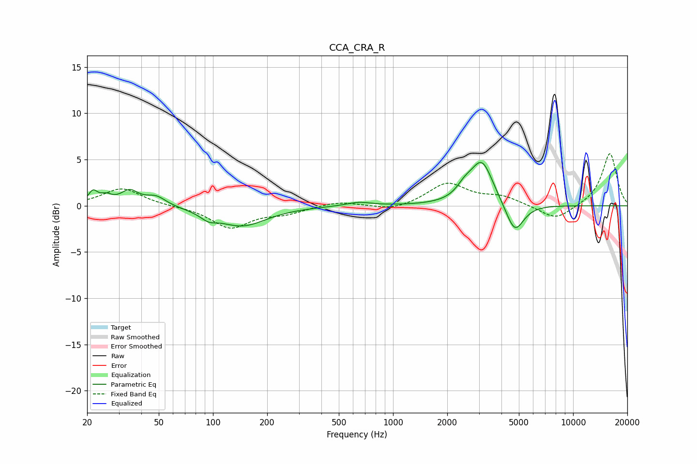

# CCA_CRA_R
See [usage instructions](https://github.com/jaakkopasanen/AutoEq#usage) for more options and info.

### Parametric EQs
Apply preamp of -4.8 dB when using parametric equalizer.

|   # | Type    |   Fc (Hz) |    Q |   Gain (dB) |
|-----|---------|-----------|------|-------------|
|   1 | Peaking |        22 | 5.62 |         1.3 |
|   2 | Peaking |        25 | 4.35 |         0.7 |
|   3 | Peaking |        34 | 2.86 |         1.5 |
|   4 | Peaking |        48 | 2.53 |         1   |
|   5 | Peaking |        94 | 3.17 |        -0.7 |
|   6 | Peaking |       145 | 1.04 |        -2.1 |
|   7 | Peaking |       644 | 2.03 |         0.4 |
|   8 | Peaking |      2493 | 3.27 |         1.1 |
|   9 | Peaking |      3115 | 2.24 |         4.8 |
|  10 | Peaking |      4742 | 2.81 |        -3.3 |

### Fixed Band EQs
When using fixed band (also called graphic) equalizer, apply preamp of **-5.7 dB** (if available) and set gains manually with these parameters.

|   # | Type    |   Fc (Hz) |    Q |   Gain (dB) |
|-----|---------|-----------|------|-------------|
|   1 | Peaking |        31 | 1.41 |         1.9 |
|   2 | Peaking |        62 | 1.41 |        -0   |
|   3 | Peaking |       125 | 1.41 |        -2.4 |
|   4 | Peaking |       250 | 1.41 |        -0.7 |
|   5 | Peaking |       500 | 1.41 |         0.5 |
|   6 | Peaking |      1000 | 1.41 |        -0.6 |
|   7 | Peaking |      2000 | 1.41 |         2.4 |
|   8 | Peaking |      4000 | 1.41 |         0.9 |
|   9 | Peaking |      8000 | 1.41 |        -1.6 |
|  10 | Peaking |     16000 | 1.41 |         5.7 |

### Graphs

