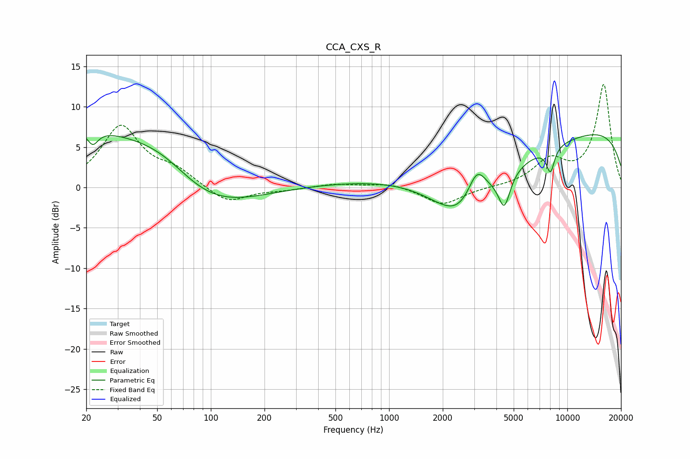

# CCA_CXS_R
See [usage instructions](https://github.com/jaakkopasanen/AutoEq#usage) for more options and info.

### Parametric EQs
Apply preamp of -6.6 dB when using parametric equalizer.

|   # | Type    |   Fc (Hz) |    Q |   Gain (dB) |
|-----|---------|-----------|------|-------------|
|   1 | Peaking |        20 | 0.27 |         7.4 |
|   2 | Peaking |        22 | 4.83 |        -1.7 |
|   3 | Peaking |        56 | 0.82 |         2.1 |
|   4 | Peaking |        89 | 0.54 |        -4.7 |
|   5 | Peaking |      1995 | 0.27 |        11.3 |
|   6 | Peaking |      2600 | 0.38 |       -20   |
|   7 | Peaking |      3106 | 2.63 |         4.3 |
|   8 | Peaking |      4431 | 4.26 |        -4.1 |
|   9 | Peaking |      8041 | 5.78 |        -3   |
|  10 | Peaking |      9405 | 0.18 |         8.8 |

### Fixed Band EQs
When using fixed band (also called graphic) equalizer, apply preamp of **-12.9 dB** (if available) and set gains manually with these parameters.

|   # | Type    |   Fc (Hz) |    Q |   Gain (dB) |
|-----|---------|-----------|------|-------------|
|   1 | Peaking |        31 | 1.41 |         7.5 |
|   2 | Peaking |        62 | 1.41 |         1.8 |
|   3 | Peaking |       125 | 1.41 |        -2.1 |
|   4 | Peaking |       250 | 1.41 |        -0.3 |
|   5 | Peaking |       500 | 1.41 |         0.4 |
|   6 | Peaking |      1000 | 1.41 |         0.6 |
|   7 | Peaking |      2000 | 1.41 |        -2.2 |
|   8 | Peaking |      4000 | 1.41 |         0   |
|   9 | Peaking |      8000 | 1.41 |         3.1 |
|  10 | Peaking |     16000 | 1.41 |        12.7 |

### Graphs

