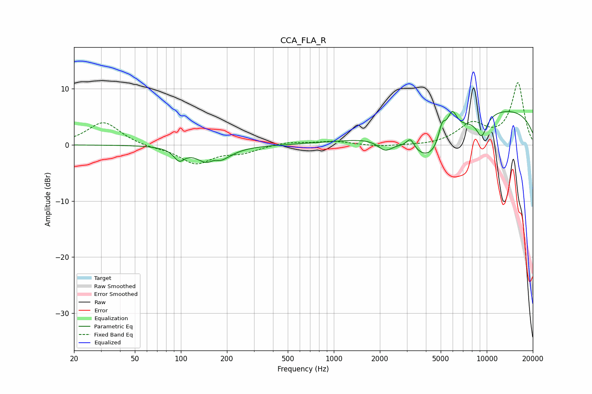

# CCA_FLA_R
See [usage instructions](https://github.com/jaakkopasanen/AutoEq#usage) for more options and info.

### Parametric EQs
Apply preamp of -6.1 dB when using parametric equalizer.

|   # | Type    |   Fc (Hz) |    Q |   Gain (dB) |
|-----|---------|-----------|------|-------------|
|   1 | Peaking |        97 | 4.02 |        -2   |
|   2 | Peaking |       162 | 1.9  |        -5.2 |
|   3 | Peaking |       164 | 3.53 |         2.4 |
|   4 | Peaking |      2167 | 2.9  |        -1.9 |
|   5 | Peaking |      3167 | 5.63 |         1.9 |
|   6 | Peaking |      4249 | 0.94 |        -7.8 |
|   7 | Peaking |      5106 | 5.84 |         3.2 |
|   8 | Peaking |      5935 | 4.17 |         4.2 |
|   9 | Peaking |      9260 | 3.5  |        -3.8 |
|  10 | Peaking |      9730 | 0.19 |         6.9 |

### Fixed Band EQs
When using fixed band (also called graphic) equalizer, apply preamp of **-11.2 dB** (if available) and set gains manually with these parameters.

|   # | Type    |   Fc (Hz) |    Q |   Gain (dB) |
|-----|---------|-----------|------|-------------|
|   1 | Peaking |        31 | 1.41 |         4.1 |
|   2 | Peaking |        62 | 1.41 |        -0.4 |
|   3 | Peaking |       125 | 1.41 |        -3.3 |
|   4 | Peaking |       250 | 1.41 |        -1.2 |
|   5 | Peaking |       500 | 1.41 |         0.6 |
|   6 | Peaking |      1000 | 1.41 |         0.6 |
|   7 | Peaking |      2000 | 1.41 |        -0.3 |
|   8 | Peaking |      4000 | 1.41 |        -0.2 |
|   9 | Peaking |      8000 | 1.41 |         3.5 |
|  10 | Peaking |     16000 | 1.41 |        11   |

### Graphs

