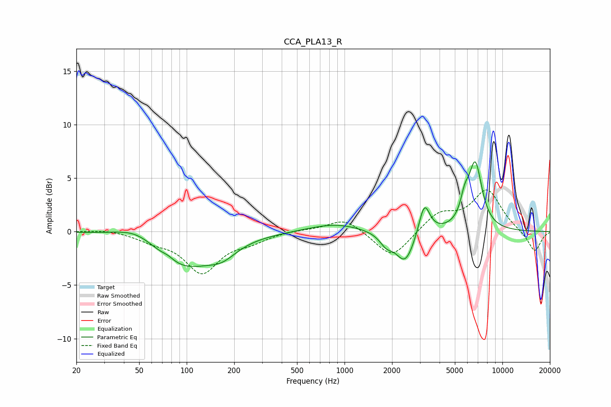

# CCA_PLA13_R
See [usage instructions](https://github.com/jaakkopasanen/AutoEq#usage) for more options and info.

### Parametric EQs
Apply preamp of -6.6 dB when using parametric equalizer.

|   # | Type    |   Fc (Hz) |    Q |   Gain (dB) |
|-----|---------|-----------|------|-------------|
|   1 | Peaking |        49 | 1.05 |         1.3 |
|   2 | Peaking |        76 | 4    |         0.3 |
|   3 | Peaking |        94 | 0.72 |        -3.4 |
|   4 | Peaking |       168 | 1.57 |        -1.1 |
|   5 | Peaking |       871 | 0.85 |         0.8 |
|   6 | Peaking |      1838 | 3.37 |        -1   |
|   7 | Peaking |      2424 | 2.4  |        -3   |
|   8 | Peaking |      3203 | 4.12 |         3   |
|   9 | Peaking |      5772 | 5.21 |         1.7 |
|  10 | Peaking |      6730 | 3.16 |         6.1 |

### Fixed Band EQs
When using fixed band (also called graphic) equalizer, apply preamp of **-4.0 dB** (if available) and set gains manually with these parameters.

|   # | Type    |   Fc (Hz) |    Q |   Gain (dB) |
|-----|---------|-----------|------|-------------|
|   1 | Peaking |        31 | 1.41 |         0.2 |
|   2 | Peaking |        62 | 1.41 |        -0.7 |
|   3 | Peaking |       125 | 1.41 |        -3.7 |
|   4 | Peaking |       250 | 1.41 |        -0.8 |
|   5 | Peaking |       500 | 1.41 |         0.2 |
|   6 | Peaking |      1000 | 1.41 |         1.3 |
|   7 | Peaking |      2000 | 1.41 |        -2.6 |
|   8 | Peaking |      4000 | 1.41 |         1.7 |
|   9 | Peaking |      8000 | 1.41 |         3.8 |
|  10 | Peaking |     16000 | 1.41 |        -2   |

### Graphs

