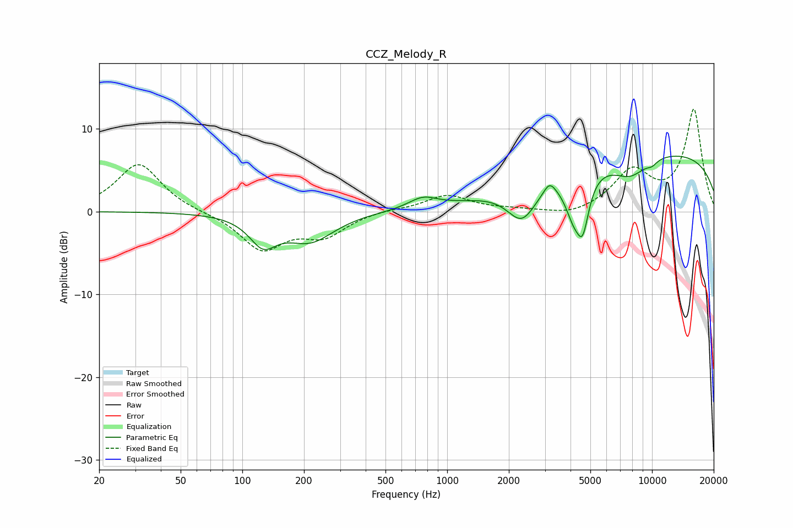

# CCZ_Melody_R
See [usage instructions](https://github.com/jaakkopasanen/AutoEq#usage) for more options and info.

### Parametric EQs
Apply preamp of -6.8 dB when using parametric equalizer.

|   # | Type    |   Fc (Hz) |    Q |   Gain (dB) |
|-----|---------|-----------|------|-------------|
|   1 | Peaking |       126 | 2.14 |        -3.3 |
|   2 | Peaking |       214 | 1.19 |        -3.4 |
|   3 | Peaking |       761 | 2.03 |         1.3 |
|   4 | Peaking |      2320 | 1.93 |        -4.4 |
|   5 | Peaking |      3159 | 5.07 |         1.3 |
|   6 | Peaking |      4137 | 3.25 |        -4.3 |
|   7 | Peaking |      4594 | 4.6  |        -5.4 |
|   8 | Peaking |      7817 | 1.58 |        -2.4 |
|   9 | Peaking |      9995 | 4.85 |        -0.5 |
|  10 | Peaking |     10000 | 0.19 |         7.3 |

### Fixed Band EQs
When using fixed band (also called graphic) equalizer, apply preamp of **-12.4 dB** (if available) and set gains manually with these parameters.

|   # | Type    |   Fc (Hz) |    Q |   Gain (dB) |
|-----|---------|-----------|------|-------------|
|   1 | Peaking |        31 | 1.41 |         5.8 |
|   2 | Peaking |        62 | 1.41 |        -0.1 |
|   3 | Peaking |       125 | 1.41 |        -4.5 |
|   4 | Peaking |       250 | 1.41 |        -2.7 |
|   5 | Peaking |       500 | 1.41 |         0.3 |
|   6 | Peaking |      1000 | 1.41 |         2   |
|   7 | Peaking |      2000 | 1.41 |         0.2 |
|   8 | Peaking |      4000 | 1.41 |        -0.7 |
|   9 | Peaking |      8000 | 1.41 |         4.7 |
|  10 | Peaking |     16000 | 1.41 |        12.2 |

### Graphs

