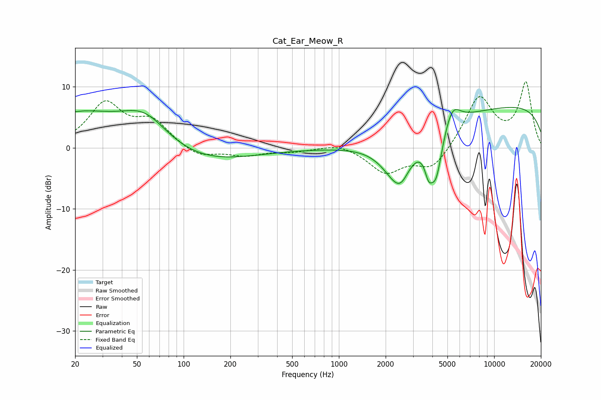

# Cat_Ear_Meow_R
See [usage instructions](https://github.com/jaakkopasanen/AutoEq#usage) for more options and info.

### Parametric EQs
Apply preamp of -6.7 dB when using parametric equalizer.

|   # | Type    |   Fc (Hz) |    Q |   Gain (dB) |
|-----|---------|-----------|------|-------------|
|   1 | Peaking |        21 | 0.53 |         5.4 |
|   2 | Peaking |        56 | 0.85 |         6.1 |
|   3 | Peaking |       101 | 0.39 |        -3.3 |
|   4 | Peaking |      2345 | 1.4  |        -6.3 |
|   5 | Peaking |      2515 | 2.9  |        -2   |
|   6 | Peaking |      3782 | 5.62 |        -3.3 |
|   7 | Peaking |      3917 | 0.28 |        -1.5 |
|   8 | Peaking |      4220 | 3.41 |        -7.8 |
|   9 | Peaking |      5370 | 2.8  |         3.5 |
|  10 | Peaking |     10000 | 0.18 |         7.5 |

### Fixed Band EQs
When using fixed band (also called graphic) equalizer, apply preamp of **-10.9 dB** (if available) and set gains manually with these parameters.

|   # | Type    |   Fc (Hz) |    Q |   Gain (dB) |
|-----|---------|-----------|------|-------------|
|   1 | Peaking |        31 | 1.41 |         7   |
|   2 | Peaking |        62 | 1.41 |         4   |
|   3 | Peaking |       125 | 1.41 |        -1.7 |
|   4 | Peaking |       250 | 1.41 |        -1.2 |
|   5 | Peaking |       500 | 1.41 |        -0.6 |
|   6 | Peaking |      1000 | 1.41 |         0.9 |
|   7 | Peaking |      2000 | 1.41 |        -4   |
|   8 | Peaking |      4000 | 1.41 |        -3.6 |
|   9 | Peaking |      8000 | 1.41 |         8.4 |
|  10 | Peaking |     16000 | 1.41 |        10.5 |

### Graphs

