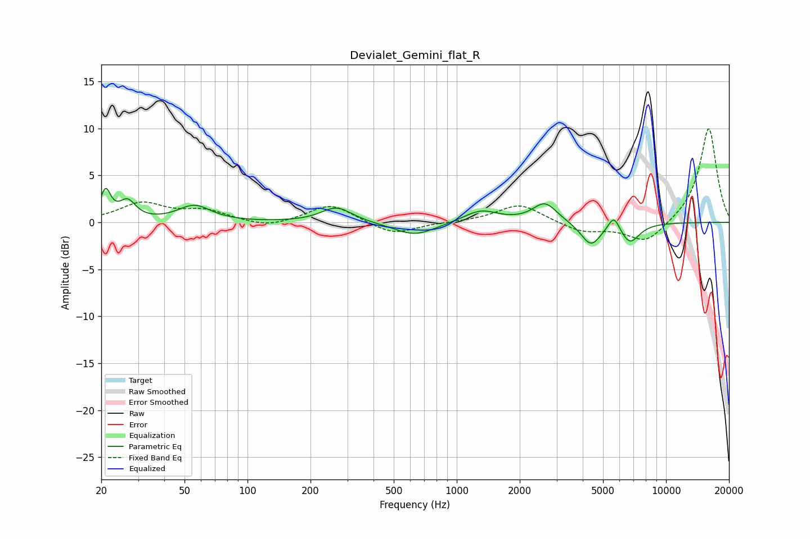

# Devialet_Gemini_flat_R
See [usage instructions](https://github.com/jaakkopasanen/AutoEq#usage) for more options and info.

### Parametric EQs
Apply preamp of -3.7 dB when using parametric equalizer.

|   # | Type    |   Fc (Hz) |    Q |   Gain (dB) |
|-----|---------|-----------|------|-------------|
|   1 | Peaking |        21 | 5.85 |         3   |
|   2 | Peaking |        27 | 3.65 |         2   |
|   3 | Peaking |        56 | 1.81 |         1.7 |
|   4 | Peaking |       266 | 1.91 |         1.6 |
|   5 | Peaking |       630 | 1.41 |        -1.4 |
|   6 | Peaking |      1302 | 1.73 |         1.3 |
|   7 | Peaking |      2641 | 2.45 |         2.1 |
|   8 | Peaking |      4378 | 2.9  |        -2.5 |
|   9 | Peaking |      5637 | 5.06 |         1.7 |
|  10 | Peaking |      6720 | 2.98 |        -2.1 |

### Fixed Band EQs
When using fixed band (also called graphic) equalizer, apply preamp of **-10.1 dB** (if available) and set gains manually with these parameters.

|   # | Type    |   Fc (Hz) |    Q |   Gain (dB) |
|-----|---------|-----------|------|-------------|
|   1 | Peaking |        31 | 1.41 |         2   |
|   2 | Peaking |        62 | 1.41 |         1.1 |
|   3 | Peaking |       125 | 1.41 |        -0.7 |
|   4 | Peaking |       250 | 1.41 |         2   |
|   5 | Peaking |       500 | 1.41 |        -1.4 |
|   6 | Peaking |      1000 | 1.41 |         0   |
|   7 | Peaking |      2000 | 1.41 |         2   |
|   8 | Peaking |      4000 | 1.41 |        -1   |
|   9 | Peaking |      8000 | 1.41 |        -2.3 |
|  10 | Peaking |     16000 | 1.41 |        10.1 |

### Graphs

