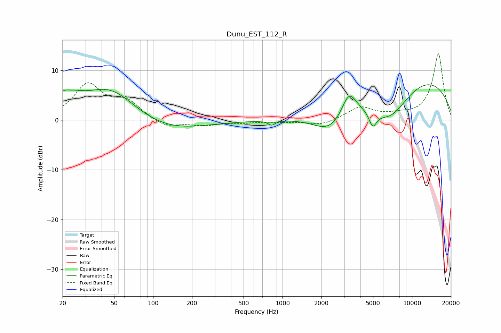

# Dunu_EST_112_R
See [usage instructions](https://github.com/jaakkopasanen/AutoEq#usage) for more options and info.

### Parametric EQs
Apply preamp of -7.2 dB when using parametric equalizer.

|   # | Type    |   Fc (Hz) |    Q |   Gain (dB) |
|-----|---------|-----------|------|-------------|
|   1 | Peaking |        20 | 3.99 |         1.5 |
|   2 | Peaking |        23 | 1.63 |         2.3 |
|   3 | Peaking |        47 | 0.65 |         7.3 |
|   4 | Peaking |       110 | 0.47 |        -3.1 |
|   5 | Peaking |       825 | 5.7  |        -0.9 |
|   6 | Peaking |      2347 | 1.09 |        -4.4 |
|   7 | Peaking |      3259 | 2.53 |         4.8 |
|   8 | Peaking |      4982 | 4.72 |        -3.1 |
|   9 | Peaking |      6794 | 0.87 |        -7.3 |
|  10 | Peaking |     10000 | 0.27 |         9.4 |

### Fixed Band EQs
When using fixed band (also called graphic) equalizer, apply preamp of **-13.4 dB** (if available) and set gains manually with these parameters.

|   # | Type    |   Fc (Hz) |    Q |   Gain (dB) |
|-----|---------|-----------|------|-------------|
|   1 | Peaking |        31 | 1.41 |         6.9 |
|   2 | Peaking |        62 | 1.41 |         3.4 |
|   3 | Peaking |       125 | 1.41 |        -1.6 |
|   4 | Peaking |       250 | 1.41 |        -1   |
|   5 | Peaking |       500 | 1.41 |        -0.4 |
|   6 | Peaking |      1000 | 1.41 |        -0.3 |
|   7 | Peaking |      2000 | 1.41 |        -1.1 |
|   8 | Peaking |      4000 | 1.41 |         2.5 |
|   9 | Peaking |      8000 | 1.41 |         0.7 |
|  10 | Peaking |     16000 | 1.41 |        13.4 |

### Graphs

