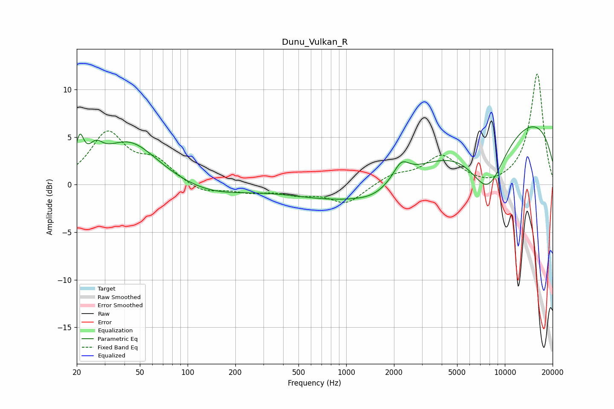

# Dunu_Vulkan_R
See [usage instructions](https://github.com/jaakkopasanen/AutoEq#usage) for more options and info.

### Parametric EQs
Apply preamp of -6.2 dB when using parametric equalizer.

|   # | Type    |   Fc (Hz) |    Q |   Gain (dB) |
|-----|---------|-----------|------|-------------|
|   1 | Peaking |        21 | 5.71 |         3.1 |
|   2 | Peaking |        26 | 3.34 |         1.6 |
|   3 | Peaking |        43 | 0.79 |         4.5 |
|   4 | Peaking |       139 | 0.65 |        -1.1 |
|   5 | Peaking |       952 | 3.23 |        -0   |
|   6 | Peaking |      1504 | 1.22 |        -0.8 |
|   7 | Peaking |      2219 | 2.86 |         1.8 |
|   8 | Peaking |      3367 | 0.18 |        -4   |
|   9 | Peaking |      7800 | 1.15 |        -5.9 |
|  10 | Peaking |      9188 | 0.2  |         9.6 |

### Fixed Band EQs
When using fixed band (also called graphic) equalizer, apply preamp of **-11.7 dB** (if available) and set gains manually with these parameters.

|   # | Type    |   Fc (Hz) |    Q |   Gain (dB) |
|-----|---------|-----------|------|-------------|
|   1 | Peaking |        31 | 1.41 |         5.3 |
|   2 | Peaking |        62 | 1.41 |         2.2 |
|   3 | Peaking |       125 | 1.41 |        -1   |
|   4 | Peaking |       250 | 1.41 |        -0.7 |
|   5 | Peaking |       500 | 1.41 |        -0.8 |
|   6 | Peaking |      1000 | 1.41 |        -2   |
|   7 | Peaking |      2000 | 1.41 |         1   |
|   8 | Peaking |      4000 | 1.41 |         2.9 |
|   9 | Peaking |      8000 | 1.41 |        -0.4 |
|  10 | Peaking |     16000 | 1.41 |        11.7 |

### Graphs

