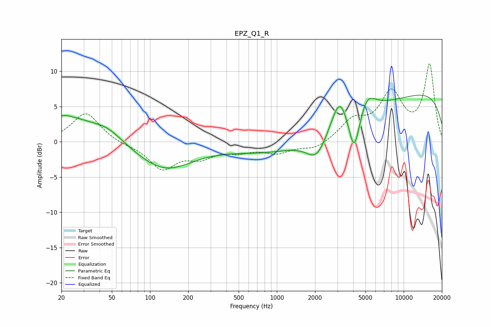

# EPZ_Q1_R
See [usage instructions](https://github.com/jaakkopasanen/AutoEq#usage) for more options and info.

### Parametric EQs
Apply preamp of -6.7 dB when using parametric equalizer.

|   # | Type    |   Fc (Hz) |    Q |   Gain (dB) |
|-----|---------|-----------|------|-------------|
|   1 | Peaking |        20 | 0.51 |         3.7 |
|   2 | Peaking |        22 | 5.21 |         0.1 |
|   3 | Peaking |        47 | 1.31 |         1.1 |
|   4 | Peaking |       129 | 0.64 |        -4   |
|   5 | Peaking |      2062 | 1.73 |        -3.5 |
|   6 | Peaking |      3028 | 0.18 |        -3.5 |
|   7 | Peaking |      3126 | 2.29 |         4.4 |
|   8 | Peaking |      4066 | 3.13 |        -6.4 |
|   9 | Peaking |      5138 | 2.19 |         2.6 |
|  10 | Peaking |      9234 | 0.18 |         8.6 |

### Fixed Band EQs
When using fixed band (also called graphic) equalizer, apply preamp of **-11.2 dB** (if available) and set gains manually with these parameters.

|   # | Type    |   Fc (Hz) |    Q |   Gain (dB) |
|-----|---------|-----------|------|-------------|
|   1 | Peaking |        31 | 1.41 |         4.2 |
|   2 | Peaking |        62 | 1.41 |        -0.3 |
|   3 | Peaking |       125 | 1.41 |        -3.7 |
|   4 | Peaking |       250 | 1.41 |        -1.9 |
|   5 | Peaking |       500 | 1.41 |        -1.1 |
|   6 | Peaking |      1000 | 1.41 |        -1.4 |
|   7 | Peaking |      2000 | 1.41 |        -1.1 |
|   8 | Peaking |      4000 | 1.41 |         2.7 |
|   9 | Peaking |      8000 | 1.41 |         6.5 |
|  10 | Peaking |     16000 | 1.41 |        10.8 |

### Graphs

